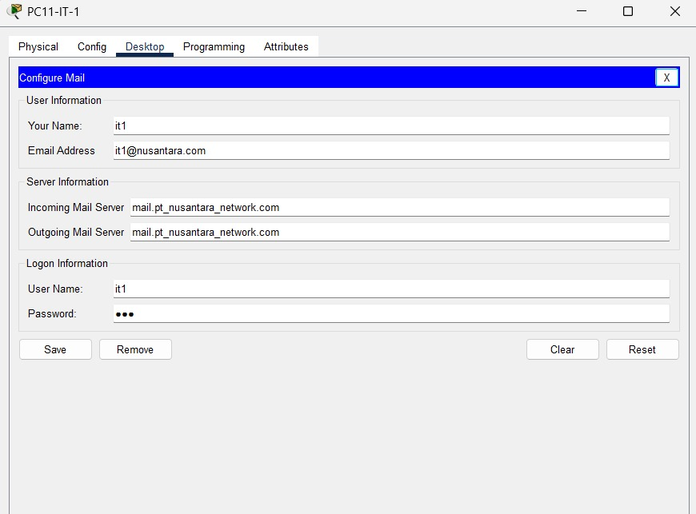

# Perencanaan Proyek PT. Nusantara Network - Pekan 15 

## Anggota Kelompok dan Peran
- Firni Fauziah Ramadhini (10231038) - Network Architect
- Alfiani Dwiyuniarti (10231010) - Network Services Specialist
- Rayhan Iqbal (10231080) - Network Engineer
- Muhammad Alif Setiawan (10231056) - Security & Documentation Specialist

## Daftar Isi
1. Pendahuluan
   - 1.1. Latar Belakang
   - 1.2. Tujuan Proyek
   - 1.3. Ruang Lingkup Proyek
2. Pembagian Kelompok dan Peran
3. Analisis Kebutuhan Jaringan PT. Nusantara Network
   - 3.1. Analisis Infrastruktur
   - 3.2. Kebutuhan Segmentasi Jaringan
   - 3.3. Kebutuhan Konektivitas
   - 3.4. Kebutuhan Layanan Jaringan
   - 3.5. Kebutuhan Keamanan Jaringan
   - 3.6. Kebutuhan Monitoring dan Manajemen
   - 3.7. Kebutuhan Skalabilitas dan Pertumbuhan
4. Timeline Rencana Kerja Proyek (Pekan 9-15)
5. Sketsa Awal Desain Jaringan
6. Diagram topologi
7. Tabel pengalamatan IP
8. Daftar perangkat yang dibutuhkan
9. Rencana penerapan VLAN (VLAN ID, nama, tujuan).
10. Pembangunan topologi dasar di Cisco Packet Tracer/GNS3
11. Konfigurasi VLAN dan trunking
12. Implementasi routing antar-VLAN
13. Konfigurasi routing statis pada jaringan intra-gedung.
14. Implementasi routing dinamis (OSPF) untuk koneksi antar-gedung.
15. Simulasi koneksi WAN antar gedung.
16. Analisis performa routing dinamis vs statis
17. Konfigurasi DHCP Server untuk setiap departemen.
18. Implementasi DNS Server untuk resolusi nama internal.
19. Konfigurasi NAT untuk akses internet.
20. Implementasi Access Control List (ACL) sesuai kebijakan keamanan.
21. Pengujian menyeluruh semua fitur jaringan.
22. Troubleshooting dan perbaikan masalah.

## 1. Pendahuluan
### 1.1 Latar Belakang
Dalam era digital saat ini, infrastruktur jaringan yang andal, aman, dan efisien menjadi tulang punggung operasional bagi perusahaan teknologi informasi. PT. Nusantara Network sebagai perusahaan yang bergerak di bidang teknologi informasi memiliki struktur organisasi yang terdistribusi dengan 4 departemen utama yang tersebar di 2 lokasi fisik berbeda. Kompleksitas ini menciptakan tantangan tersendiri dalam hal pengelolaan jaringan.

Kondisi jaringan yang ada saat ini belum optimal karena belum menerapkan segmentasi yang tepat antar departemen, yang dapat menyebabkan risiko keamanan dan inefisiensi dalam pengelolaan traffic data. Selain itu, konektivitas antar gedung masih menggunakan solusi ad-hoc yang tidak terstandarisasi dan sulit dikelola. Layanan-layanan penting seperti DHCP, DNS, dan akses internet juga memerlukan implementasi yang terstruktur.

Kebutuhan akan keamanan data semakin meningkat, terutama dengan adanya departemen Keuangan dan SDM yang menangani informasi sensitif. Tanpa adanya kebijakan akses yang jelas antar departemen, risiko kebocoran data menjadi perhatian serius. Selain itu, perusahaan juga membutuhkan sistem monitoring dan manajemen jaringan terpusat untuk memudahkan pengelolaan infrastruktur yang semakin kompleks.

Oleh karena itu, dibutuhkan perancangan dan implementasi infrastruktur jaringan yang komprehensif untuk mengatasi tantangan tersebut dan mendukung pertumbuhan bisnis PT. Nusantara Network di masa depan.

### 1.2 Tujuan
Proyek perancangan dan implementasi jaringan PT. Nusantara Network memiliki tujuan sebagai berikut:

- Merancang dan mengimplementasikan infrastruktur jaringan yang aman, efisien, dan mudah dikelola untuk mendukung operasional perusahaan.
- Membangun segmentasi jaringan melalui implementasi VLAN untuk setiap departemen guna meningkatkan keamanan dan manajemen traffic data.
- Mengimplementasikan konektivitas antar gedung yang andal melalui teknologi WAN dan routing dinamis (OSPF).
- Menyediakan layanan jaringan esensial seperti DHCP untuk alokasi IP otomatis, DNS untuk resolusi nama, dan NAT untuk akses internet.
- Menerapkan kebijakan keamanan melalui Access Control List (ACL) untuk membatasi akses antar departemen sesuai dengan kebutuhan operasional dan keamanan.
- Membangun sistem monitoring dan manajemen jaringan terpusat untuk memudahkan pengelolaan dan pemeliharaan infrastruktur.
- Menyediakan dokumentasi teknis yang komprehensif untuk mendukung operasional dan pengembangan jaringan di masa depan.

### 1.3 Ruang Lingkup
Ruang lingkup proyek perancangan dan implementasi jaringan PT. Nusantara Network mencakup:

- **Perancangan Topologi Jaringan**:
  - Desain topologi fisik dan logis untuk Kantor Pusat (Gedung A) dan Kantor Cabang (Gedung B)
  - Penentuan spesifikasi dan penempatan perangkat jaringan (router, switch, dan server)

- **Skema Pengalamatan IP dan Subnetting**:
  - Perencanaan skema alamat IP untuk seluruh departemen dan server
  - Implementasi teknik subnetting untuk alokasi IP yang efisien

- **Implementasi VLAN dan Segmentasi Jaringan**:
  - Konfigurasi VLAN terpisah untuk setiap departemen (IT, Keuangan, SDM, Marketing, dan Operasional)
  - Implementasi VLAN trunking untuk efisiensi koneksi antar switch
  - Konfigurasi routing antar-VLAN

- **Routing dan Konektivitas WAN**:
  - Implementasi routing statis untuk koneksi internal di setiap gedung
  - Konfigurasi routing dinamis (OSPF) untuk manajemen rute antar gedung
  - Implementasi teknologi WAN untuk koneksi antar gedung dengan bandwidth terbatas

- **Layanan Jaringan**:
  - Konfigurasi server DHCP untuk alokasi IP otomatis di setiap departemen
  - Implementasi layanan DNS untuk resolusi nama internal dan eksternal
  - Konfigurasi NAT untuk akses internet melalui ISP

- **Implementasi Keamanan Jaringan**:
  - Perancangan dan implementasi Access Control List (ACL) untuk membatasi akses antar departemen
  - Penerapan kebijakan keamanan sesuai dengan kebutuhan bisnis

- **Pengujian dan Validasi**:
  - Pengujian konektivitas antar departemen dan antar gedung
  - Validasi implementasi kebijakan keamanan
  - Pengujian layanan jaringan (DHCP, DNS, NAT)

- **Dokumentasi**:
  - Dokumentasi desain jaringan
  - Dokumentasi konfigurasi perangkat
  - Pedoman operasional dan troubleshooting 

## 2. Pembagian Kelompok dan Peran
- Firni Fauziah Ramadhini (10231038) - Network Architect
  - Bertanggung jawab untuk merancang topologi jaringan secara keseluruhan
  - Menentukan arsitektur jaringan yang optimal dengan mempertimbangkan kebutuhan bisnis
  - Membuat skema pengalamatan IP dan subnetting
  - Memastikan desain jaringan memenuhi persyaratan performa, skalabilitas, dan ketersediaan

- Alfiani Dwiyuniarti (10231010) - Network Services Specialist
  - Merancang dan mengimplementasikan layanan jaringan (DHCP, DNS, NAT)
  - Mengoptimalkan kinerja layanan jaringan
  - Mengintegrasikan layanan jaringan dengan infrastruktur yang ada
  - Memastikan konfigurasi layanan sesuai dengan kebutuhan masing-masing departemen

- Rayhan Iqbal (10231080) - Network Engineer
  - Bertanggung jawab untuk konfigurasi perangkat jaringan (router, switch)
  - Mengimplementasikan VLAN dan segmentasi jaringan
  - Menerapkan protokol routing (OSPF) untuk konektivitas antar gedung
  - Melakukan troubleshooting masalah jaringan

- Muhammad Alif Setiawan (10231056) - Security & Documentation Specialist
  - Merancang dan mengimplementasikan kebijakan keamanan jaringan (ACL)
  - Mengidentifikasi dan mitigasi risiko keamanan di infrastruktur
  - Membuat dokumentasi teknis yang komprehensif (diagram, konfigurasi perangkat, dll)
  - Menyusun pedoman operasional dan prosedur troubleshooting

## 3. Analisis Kebutuhan Jaringan PT. Nusantara Network
### 3.1 Analisis Infrastruktur
PT. Nusantara Network merupakan perusahaan teknologi informasi dengan struktur organisasi yang terdistribusi di 2 lokasi fisik berbeda (Gedung A dan Gedung B) dengan total 4 departemen utama. Berikut adalah kondisi infrastruktur saat ini:

Kantor Pusat (Gedung A):
- Departemen IT (40 komputer)
- Departemen Keuangan (25 komputer)
- Departemen SDM (20 komputer)
- Server Farm (10 server untuk berbagai layanan)

Kantor Cabang (Gedung B):
- Departemen Marketing (30 komputer)
- Departemen Operasional (35 komputer)

Belum ada segmentasi jaringan yang tepat antar departemen, konektivitas antar gedung masih menggunakan solusi ad-hoc yang tidak terstandarisasi, dan belum ada penerapan kebijakan keamanan yang terstruktur untuk membatasi akses antar departemen.

### 3.2 Kebutuhan Segmentasi Jaringan
Berdasarkan struktur organisasi dan kebutuhan operasional, PT. Nusantara Network memerlukan segmentasi jaringan sebagai berikut:
  - Segmentasi berbasis VLAN untuk setiap departemen:
    - VLAN Departemen IT
    - VLAN Departemen Keuangan
    - VLAN Departemen SDM
    - VLAN Departemen Marketing
    - VLAN Departemen Operasional
    - VLAN Server Farm
    - VLAN Manajemen

Alasan Implementasi VLAN:
- Meningkatkan keamanan dengan membatasi traffic antar departemen
- Mempermudah manajemen jaringan dan pengalokasian alamat IP
- Mengoptimalkan performa jaringan dengan mengurangi domain broadcast
- Memberikan fleksibilitas dalam pengelolaan jaringan tanpa perubahan fisik

### 3.3 Kebutuhan Konektivitas
Konektivitas LAN:
- Switching infrastructure yang mendukung VLAN dan trunking
- Implementasi routing antar-VLAN untuk memungkinkan komunikasi antar departemen
- Koneksi redundan untuk perangkat kritikal pada server farm

Konektivitas WAN:
- Koneksi WAN yang andal antara Gedung A dan Gedung B dengan bandwidth yang terukur
- Implementasi routing dinamis (OSPF) untuk manajemen rute antar gedung
- Koneksi ISP untuk akses internet

Konektivitas Internet:
- Layanan internet dedicated dengan bandwidth yang memadai untuk mendukung operasional
- Implementasi NAT untuk akses internet melalui ISP

### 3.4 Kebutuhan Layanan Jaringan
Layanan DHCP:
- Server DHCP untuk alokasi IP otomatis pada setiap departemen
- Scope DHCP terpisah untuk masing-masing VLAN

Layanan DNS:
- Server DNS untuk resolusi nama internal dan eksternal
- Implementasi DNS hierarchy untuk memudahkan manajemen resource

Layanan Server:
- Infrastruktur server untuk mendukung aplikasi-aplikasi bisnis
- Server untuk monitoring dan manajemen jaringan

### 3.5 Kebutuhan Keamanan Jaringan
Access Control List (ACL):
- Implementasi ACL untuk membatasi akses antar departemen
- Penerapan kebijakan khusus untuk melindungi informasi sensitif di Departemen Keuangan dan SDM

Keamanan Perimeter:
- Implementasi Next Generation Firewall untuk melindungi jaringan dari ancaman eksternal
- Intrusion Prevention System (IPS) untuk mendeteksi dan mencegah serangan

Endpoint Protection:
- Solusi endpoint security untuk melindungi perangkat end-user
- Manajemen terpusat untuk kebijakan keamanan

### 3.6 Kebutuhan Monitoring dan Manajemen
Network Monitoring:
- Sistem monitoring terpusat untuk memantau kinerja jaringan
- Alert system untuk notifikasi masalah jaringan
- Visibilitas terhadap traffic jaringan untuk analisis dan troubleshooting

Manajemen Konfigurasi:
- Sistem manajemen konfigurasi terpusat
- Standardisasi konfigurasi perangkat jaringan
- Dokumentasi konfigurasi yang terstruktur

### 3.7 Kebutuhan Skalabilitas dan Pertumbuhan
Kapasitas:
- Perangkat jaringan harus mampu menangani jumlah endpoint saat ini dengan margin 30% untuk pertumbuhan
- Rencana pengalamatan IP harus mengakomodasi pertumbuhan di masa depan

Teknologi:
- Implementasi solusi yang mendukung teknologi terbaru seperti IPv6
- Kemampuan untuk mengadopsi teknologi jaringan yang berkembang seperti SD-WAN

## 4. Timeline Rencana Kerja Proyek (Pekan 9-15)
###  Timeline Rencana Kerja (7 Pekan)
| Pekan | Kegiatan                                | Output                                      |
|-------|------------------------------------------|---------------------------------------------|
| 9     | Perencanaan & Desain Awal               | Dokumen perencanaan                         |
| 10    | Desain Topologi Final + VLAN & IP Plan  | Diagram final + Tabel IP                    |
| 11    | Konfigurasi DHCP, DNS, NAT              | Skrip konfigurasi                           |
| 12    | Implementasi Routing OSPF               | Routing antar VLAN & antar gedung           |
| 13    | Implementasi ACL                        | Dokumen kebijakan akses                     |
| 14    | Monitoring & Manajemen Jaringan         | Laporan hasil simulasi monitoring           |
| 15    | Uji Coba & Dokumentasi Akhir            | Laporan akhir & presentasi proyek           |

## 5. Sketsa Awal Desain Jaringan


### Gedung A (Kantor Pusat)
#### Router Pusat
Router ini berfungsi sebagai pusat konektivitas jaringan internal Gedung A ke jaringan eksternal melalui router ISP. Selain itu, router pusat juga mengatur distribusi data antar VLAN dengan menerapkan protokol OSPF untuk routing dinamis, NAT untuk koneksi ke internet, dan ACL untuk pembatasan akses antar departemen.

#### Main Switch Pusat
Main switch ini merupakan tulang punggung jaringan di Gedung A yang menghubungkan semua switch departemen serta switch server. Perangkat ini menjadi pusat penghubung antar VLAN seperti VLAN 10 (IT), VLAN 20 (Keuangan), VLAN 30 (SDM), dan VLAN 40 (Server).

#### Switch VLAN Departemen
- **Switch IT (VLAN 10 – 40 PC)**: Digunakan untuk menghubungkan komputer di ruang IT. VLAN ini memiliki akses penuh ke seluruh jaringan karena peran IT sebagai pengelola sistem.

- **Switch Keuangan (VLAN 20 – 25 PC)**: Menghubungkan perangkat departemen keuangan. Akses VLAN ini dibatasi hanya untuk kebutuhan internal, tanpa akses langsung ke server.

- **Switch SDM (VLAN 30 – 20 PC)**: Terkoneksi dengan komputer di ruang SDM. Seperti VLAN keuangan, VLAN ini juga memiliki akses terbatas hanya untuk operasional internal.

#### Switch Server dan Server-Server Internal
- **Switch Server (VLAN 40)**: Berfungsi sebagai penghubung utama untuk semua server yang ditempatkan di server room.

- **Server 1–10 (VLAN 40)**: Menyediakan berbagai layanan penting seperti:
  - **Server 1 (DHCP + DNS)**: Bertugas memberikan alamat IP ke seluruh VLAN melalui DHCP Relay, serta menangani permintaan DNS.
  - **Server Web, Email, FTP, dan Database**: Mendukung aplikasi internal dan komunikasi perusahaan.
  - **AAA Server**: Menangani otentikasi, otorisasi, dan pencatatan aktivitas pengguna di jaringan.
  - **Monitoring Server**: Memantau kondisi dan performa jaringan menggunakan alat seperti PRTG atau Syslog.
  - **NTP dan Backup Server**: Mengatur sinkronisasi waktu dan penyimpanan data cadangan.

### Gedung B (Kantor Cabang)
#### Router Cabang
Router ini berfungsi menghubungkan jaringan lokal Gedung B ke kantor pusat melalui router ISP. Sama seperti di pusat, router ini juga menggunakan OSPF untuk mendukung komunikasi antar gedung yang efisien.

#### Main Switch Cabang
Switch utama yang mendistribusikan koneksi ke seluruh perangkat dan switch departemen di Gedung B.

#### Switch VLAN Departemen
- **Switch Marketing (VLAN 50 – 30 PC)**: Menghubungkan komputer di departemen pemasaran. VLAN ini tidak diperbolehkan mengakses server di pusat demi keamanan data.

- **Switch Operasional (VLAN 60 – 35 PC)**: Digunakan oleh tim operasional, dengan hak akses terbatas hanya ke DNS Server dan internet, sesuai kebijakan ACL.

### Koneksi Eksternal & Antar Gedung
- **Internet Cloud**: Mewakili akses ke jaringan global.
- **Router ISP**: Menjadi jembatan antara jaringan internal (Pusat & Cabang) ke internet.
- **Router Pusat dan Cabang**: Masing-masing terhubung ke router ISP dan menjadi titik komunikasi antar gedung.

### Keamanan dan Pengaturan Akses (ACL)
- **VLAN 10 (IT)**: Memiliki hak akses penuh ke seluruh sistem dan server.
- **VLAN 20 (Keuangan) & VLAN 30 (SDM)**: Hanya memiliki akses internal, tidak langsung ke server.
- **VLAN 50 (Marketing)**: Tidak diizinkan mengakses VLAN Server.
- **VLAN 60 (Operasional)**: Hanya diizinkan mengakses DNS Server dan internet.
- Semua pengaturan akses dilakukan melalui ACL pada Router Pusat.

### Protokol dan Layanan Jaringan
- **Routing Dinamis OSPF**: Digunakan untuk menjamin konektivitas antar router pusat dan cabang.
- **NAT**: Dijalankan di Router Pusat untuk menerjemahkan alamat internal ke alamat publik.
- **Monitoring Server**: Memastikan performa jaringan tetap optimal dan terekam dengan baik.
- **Layanan Server Lain**: Menyediakan HTTP/HTTPS, SMTP/POP3, FTP, database, NTP, dan layanan backup.

## 6. Diagram topologi


###  Gedung A (Kantor Pusat)

###  Router Pusat  
Router ini berfungsi sebagai pusat konektivitas jaringan internal Gedung A ke jaringan eksternal melalui router ISP. Selain itu, router pusat juga mengatur distribusi data antar VLAN dengan menerapkan protokol **OSPF** untuk routing dinamis, **NAT** untuk koneksi ke internet, dan **ACL** untuk pembatasan akses antar departemen.

###  Main Switch Pusat  
Main switch ini merupakan tulang punggung jaringan di Gedung A yang menghubungkan semua switch departemen serta switch server. Perangkat ini menjadi pusat penghubung antar VLAN seperti VLAN 10 (IT), VLAN 20 (Keuangan), VLAN 30 (SDM), dan VLAN 40 (Server).

###  Lantai 1 – Ruangan Operasional

###  VLAN 10 – Departemen IT  
- **Jumlah PC**: 40  
- **Switch akses**: 2 switch lalu terhubung ke Switch IT  
- **Terhubung ke**: Main switch (Gedung A)  
- **Pembagian PC per switch**:  
  `40 PC / 2 switch = 20 PC per switch`

###  VLAN 20 – Departemen Keuangan  
- **Jumlah PC**: 25  
- **Switch akses**: 2 switch lalu terhubung ke Switch Keuangan  
- **Terhubung ke**: Main switch (Gedung A)  
- **Pembagian PC per switch**:  
  `25 PC / 2 switch = 13 PC & 12 PC`

###  VLAN 30 – Departemen SDM  
- **Jumlah PC**: 20  
- **Switch akses**: 1 switch lalu terhubung ke Switch SDM  
- **Terhubung ke**: Main switch (Gedung A)  
- **Pembagian PC per switch**:  
  Langsung ke 1 switch (tanpa pembagian)

### Lantai 2 – Server Room

###  VLAN 40 – Server  
- **Jumlah server**: 10  
- **Switch akses**: 1 switch lalu terhubung ke Switch Server  
- **Terhubung ke**: Main switch (Gedung A)  
- **Pembagian server per switch**:  
  Langsung ke 1 switch (tanpa pembagian)

###  Server 1–10 (VLAN 40)
Menyediakan berbagai layanan penting seperti:  
- **Server 1 (DHCP + DNS)**: Memberikan IP ke seluruh VLAN (via DHCP Relay) dan menangani DNS.  
- **Server Web, Email, FTP, dan Database**: Mendukung aplikasi internal dan komunikasi.  
- **AAA Server**: Menangani autentikasi, otorisasi, dan pencatatan aktivitas jaringan.  
- **Monitoring Server**: Memantau kondisi dan performa jaringan (PRTG, Syslog).  
- **NTP & Backup Server**: Sinkronisasi waktu dan cadangan data.


###  Gedung B (Kantor Cabang)

###  Router Cabang  
Router ini menghubungkan jaringan lokal Gedung B ke kantor pusat melalui router ISP. Seperti di pusat, router ini juga menggunakan **OSPF** untuk komunikasi antar gedung yang efisien.

###  Main Switch Cabang  
Switch utama yang mendistribusikan koneksi ke seluruh perangkat dan switch departemen di Gedung B.

###  VLAN 50 – Departemen Marketing  
- **Jumlah PC**: 30  
- **Switch akses**: 2 switch lalu terhubung ke Switch Marketing  
- **Terhubung ke**: Main switch (Gedung B)  
- **Pembagian PC per switch**:  
  `30 PC / 2 switch = 15 PC per switch`

###  VLAN 60 – Departemen Operasional  
- **Jumlah PC**: 35  
- **Switch akses**: 2 switch lalu terhubung ke Switch Operasional  
- **Terhubung ke**: Main switch (Gedung B)  
- **Pembagian PC per switch**:  
  `35 PC / 2 switch = 18 PC & 17 PC`


###  Koneksi Eksternal & Antar Gedung

- **Internet Cloud**: Mewakili koneksi ke internet global.  
- **Router ISP/Internet**: Jembatan antara jaringan internal dan dunia luar serta menjadi hubungan koneksi internet.  
- **Router Pusat & Cabang**: Terhubung ke router ISP, menjadi titik komunikasi antar gedung.


###  Keamanan dan Pengaturan Akses (ACL)

- **VLAN 10 (IT)**: Akses penuh ke seluruh sistem dan server.  
- **VLAN 20 (Keuangan)** & **VLAN 30 (SDM)**: Akses internal saja, tanpa akses ke server.  
- **VLAN 50 (Marketing)**: Tidak diizinkan mengakses VLAN Server.  
- **VLAN 60 (Operasional)**: Hanya diizinkan akses ke DNS Server dan internet.  
- Semua pengaturan dikendalikan oleh **ACL pada Router Pusat**.


###  Protokol dan Layanan Jaringan

- **Routing Dinamis OSPF**: Menjamin konektivitas antar router pusat dan cabang.  
- **NAT**: Dijalankan di Router Pusat untuk akses internet.  
- **Monitoring Server**: Menjaga performa jaringan tetap optimal.  
- **Layanan Server Lain**: HTTP/HTTPS, SMTP/POP3, FTP, Database, NTP, dan Backup.


## 7. Tabel pengalamatan IP

| VLAN ID | Nama VLAN | Subnet | Gateway | Range IP | Jumlah Host |
|---------|-----------|--------|---------|----------|-------------|
| 10 | IT | 192.168.10.0/24 | 192.168.10.1 | 192.168.10.2 - 192.168.10.254 | 253 |
| 20 | Keuangan | 192.168.20.0/24 | 192.168.20.1 | 192.168.20.2 - 192.168.20.254 | 253 |
| 30 | SDM | 192.168.30.0/24 | 192.168.30.1 | 192.168.30.2 - 192.168.30.254 | 253 |
| 40 | Server | 192.168.40.0/24 | 192.168.40.1 | 192.168.40.2 - 192.168.40.254 | 253 |
| 50 | Marketing | 192.168.50.0/24 | 192.168.50.1 | 192.168.50.2 - 192.168.50.254 | 253 |
| 60 | Operasional | 192.168.60.0/24 | 192.168.60.1 | 192.168.60.2 - 192.168.60.254 | 253 |
| ISP | Internet | 10.10.10.0/30 | 10.10.10.1 | 10.10.10.2 - 10.10.10.3 | 2 |
| WAN | Antarkantor | 172.16.1.0/30 | 172.16.1.1 | 172.16.1.2 - 172.16.1.3 | 2 |


## 8. Daftar perangkat yang dibutuhkan
| Perangkat        | Jumlah | Lokasi              | Fungsi                                      |
|------------------|--------|----------------------|---------------------------------------------|
| Router           | 2      | Pusat & Cabang       | Routing, NAT, ACL, OSPF                     |
| Router ISP/Internet          |   2    | luar/Koneksi Eksternal       | Penghubung ke router-router kantor melalui koneksi serta Penguhubung Koneksi Internet              |
| WAN          | 1      | luar/Koneksi Eksternal       | Diwakili oleh cloud "Internet"                   |
| Main Switch      | 2      | Gedung A & B         | Penghubung antar VLAN                       |
| Switch Akses     | 14     | Gedung A & B         | Menghubungkan PC/server ke jaringan serta Main switch         |
| Server           | 10     | Server Room Gedung A | Layanan DHCP, DNS, Web, Email, Backup, dll |

## 9. Rencana penerapan VLAN (VLAN ID, nama, tujuan).
| VLAN ID | Nama VLAN   | Tujuan                          | Keterangan                                                                 |
|---------|-------------|---------------------------------|----------------------------------------------------------------------------|
| 10      | IT          | Jaringan Administratif TI       | Akses penuh ke semua perangkat jaringan dan server                        |
| 20      | Keuangan    | Keamanan Transaksi Finansial    | Isolasi data keuangan dengan ACL ketat Pusat                                     |
| 30      | SDM          | Manajemen Data Karyawan         | Terpisah untuk proteksi data personal Pusat                                     |
| 40      | Server      | Infrastruktur Server Internal   |  VLAN khusus untuk semua server dengan policy keamanan tinggi              |
| 50      | Marketing   | Aktivitas Digital Marketing     | Prioritas bandwidth untuk kebutuhan kreatif                             |
| 60      | Operasional | Perangkat Operasional Harian    | Termasuk printer dan IoT device dengan akses terbatas                     |
| ISP     | Internet      | Penyedia Jaringan                    | Koneksi eksternal ke penyedia layanan internet                            |
| WAN     | Antarkantor        | Koneksi Internet                      | Interkoneksi dedicated antara gedung pusat dan cabang    

## 10. Pembangunan topologi dasar di Cisco Packet Tracer/GNS3.


###  Gedung A (Kantor Pusat)

###  Router Pusat  
Router ini berfungsi sebagai pusat konektivitas jaringan internal Gedung A ke jaringan eksternal melalui router ISP dan router Cabang B.
###  Main Switch Pusat A
Main switch ini merupakan tulang punggung jaringan di Gedung A yang menghubungkan semua switch departemen serta switch server. Perangkat ini menjadi pusat penghubung antar VLAN seperti VLAN 10 (IT), VLAN 20 (Keuangan), VLAN 30 (SDM), dan VLAN 40 (Server).

###  Lantai 1 – Ruangan Operasional

###  VLAN 10 – Departemen IT  
- **Jumlah PC**: 40  
- **Switch akses**: 2 switch lalu terhubung ke Switch Utama A
- **Terhubung ke**: Main switch (Gedung A)  
- **Pembagian PC per switch**:  
  `40 PC / 2 switch = 20 PC per switch`

###  VLAN 20 – Departemen Keuangan  
- **Jumlah PC**: 25  
- **Switch akses**: 2 switch lalu terhubung ke Switch Utama A
- **Terhubung ke**: Main switch (Gedung A)  
- **Pembagian PC per switch**:  
  `25 PC / 2 switch = 13 PC & 12 PC`

###  VLAN 30 – Departemen SDM  
- **Jumlah PC**: 20  
- **Switch akses**: 1 switch lalu terhubung ke Switch Utama A
- **Terhubung ke**: Main switch (Gedung A)  
- **Pembagian PC per switch**:  
  Langsung ke 1 switch (tanpa pembagian)

### Lantai 2 – Server Room

###  VLAN 40 – Server  
- **Jumlah server**: 10  
- **Switch akses**: 1 switch lalu terhubung ke Switch Utama A
- **Terhubung ke**: Main switch (Gedung A)  
- **Pembagian server per switch**:  
  Langsung ke 1 switch (tanpa pembagian)

###  Server 1–10 (VLAN 40)
Menyediakan berbagai layanan penting seperti:  
- **Server 1 (DHCP + DNS)**: Memberikan IP ke seluruh VLAN (via DHCP Relay) dan menangani DNS.  
- **Server Web, Email, FTP, dan Database**: Mendukung aplikasi internal dan komunikasi.   
- **Monitoring Server**: Memantau kondisi dan performa jaringan (PRTG, Syslog).  
- **NTP & Backup Server**: Sinkronisasi waktu dan cadangan data.


###  Gedung B (Kantor Cabang)

###  Router Cabang B
Router ini menghubungkan jaringan lokal Gedung B ke kantor pusat melalui router ISP dan router pusat A. Seperti di pusat.

###  Main Switch Cabang B
Switch utama yang mendistribusikan koneksi ke seluruh perangkat dan switch departemen di Gedung B.

###  VLAN 50 – Departemen Marketing  
- **Jumlah PC**: 30  
- **Switch akses**: 2 switch lalu terhubung ke Switch Utama B
- **Terhubung ke**: Main switch (Gedung B)  
- **Pembagian PC per switch**:  
  `30 PC / 2 switch = 15 PC per switch`

###  VLAN 60 – Departemen Operasional  
- **Jumlah PC**: 35  
- **Switch akses**: 2 switch lalu terhubung ke Switch Utama B
- **Terhubung ke**: Main switch (Gedung B)  
- **Pembagian PC per switch**:  
  `35 PC / 2 switch = 18 PC & 17 PC`


###  Koneksi Eksternal & Antar Gedung

- **Internet Cloud**: Mewakili koneksi ke internet global.  
- **Router ISP/Internet**: Jembatan antara jaringan internal dan dunia luar serta menjadi hubungan Router koneksi internet.  
- **Router Pusat & Cabang**: Terhubung ke router ISP, menjadi titik komunikasi antar gedung.


## Tabel IP

| VLAN ID | Nama VLAN | Subnet | Gateway | Range IP | Jumlah Host |
|---------|-----------|--------|---------|----------|-------------|
| 10 | IT | 192.168.10.0/24 | 192.168.10.1 | 192.168.10.2 - 192.168.10.254 | 253 |
| 20 | Keuangan | 192.168.20.0/24 | 192.168.20.1 | 192.168.20.2 - 192.168.20.254 | 253 |
| 30 | SDM | 192.168.30.0/24 | 192.168.30.1 | 192.168.30.2 - 192.168.30.254 | 253 |
| 40 | Server | 192.168.40.0/24 | 192.168.40.1 | 192.168.40.2 - 192.168.40.254 | 253 |
| 50 | Marketing | 192.168.50.0/24 | 192.168.50.1 | 192.168.50.2 - 192.168.50.254 | 253 |
| 60 | Operasional | 192.168.60.0/24 | 192.168.60.1 | 192.168.60.2 - 192.168.60.254 | 253 |
| ISP | Internet | 10.10.10.0/30 | 10.10.10.1 | 10.10.10.2 - 10.10.10.3 | 2 |
| WAN | Antarkantor | 172.16.1.0/30 | 172.16.1.1 | 172.16.1.2 - 172.16.1.3 | 2 |


## Perangkat yang dibutuhkan
| Perangkat        | Jumlah | Lokasi              | Fungsi                                      |
|------------------|--------|----------------------|---------------------------------------------|
| Router           | 2      | Pusat & Cabang       | Routing, NAT, ACL, OSPF                     |
| Router ISP dan Internet          |   2    | luar/Koneksi Eksternal       | Penghubung ke router-router kantor melalui koneksi serta Penguhubung Koneksi Internet              |
| WAN (Cloud)         | 1      | luar/Koneksi Eksternal       | Diwakili oleh cloud "Internet"                   |
| Main Switch      | 2      | Gedung A & B         | Penghubung antar VLAN                       |
| Switch Akses     | 6A&4B     | Gedung A & B         | Menghubungkan PC/server ke jaringan serta Main switch         |
| Server           | 10     | Server Room Gedung A | Layanan DHCP, DNS, Web, Email, Backup, dll |


## 11. Konfigurasi VLAN dan trunking.
### Konfigurasi vlan dan trunking Router A


## Main Switch Router A
```bash
Main-Switch-Router-A>enable
Main-Switch-Router-A#configure terminal
Enter configuration commands, one per line.  End with CNTL/Z.
Main-Switch-Router-A(config)#
Main-Switch-Router-A(config)#! Buat VLAN
Main-Switch-Router-A(config)#vlan 10
Main-Switch-Router-A(config-vlan)# name IT
Main-Switch-Router-A(config-vlan)#exit
Main-Switch-Router-A(config)#vlan 20
Main-Switch-Router-A(config-vlan)# name Keuangan
Main-Switch-Router-A(config-vlan)#exit
Main-Switch-Router-A(config)#vlan 30
Main-Switch-Router-A(config-vlan)# name SDM
Main-Switch-Router-A(config-vlan)#exit
Main-Switch-Router-A(config)#vlan 40
Main-Switch-Router-A(config-vlan)# name Server
Main-Switch-Router-A(config-vlan)#exit
Main-Switch-Router-A(config)#
Main-Switch-Router-A(config)#! Konfigurasi Trunk Port (Fa0/5 ke Router)
Main-Switch-Router-A(config)#interface FastEthernet0/5
Main-Switch-Router-A(config-if)# switchport mode trunk
Main-Switch-Router-A(config-if)# switchport trunk allowed vlan 10,20,30,40
Main-Switch-Router-A(config-if)# no shutdown
Main-Switch-Router-A(config-if)#exit
Main-Switch-Router-A(config)#
Main-Switch-Router-A(config)#! Konfigurasi Access Ports:
Main-Switch-Router-A(config)#interface FastEthernet0/1
Main-Switch-Router-A(config-if)# switchport mode trunk

Main-Switch-Router-A(config-if)# switchport access vlan 10
Main-Switch-Router-A(config-if)# no shutdown
Main-Switch-Router-A(config-if)#exit
Main-Switch-Router-A(config)#
Main-Switch-Router-A(config)#! Konfigurasi Access Ports:
Main-Switch-Router-A(config)#interface FastEthernet0/2
Main-Switch-Router-A(config-if)# switchport mode trunk

Main-Switch-Router-A(config-if)# switchport access vlan 10
Main-Switch-Router-A(config-if)# no shutdown
Main-Switch-Router-A(config-if)#exit
Main-Switch-Router-A(config)#
Main-Switch-Router-A(config)#interface FastEthernet0/3
Main-Switch-Router-A(config-if)# switchport mode trunk

Main-Switch-Router-A(config-if)# switchport access vlan 20
Main-Switch-Router-A(config-if)# no shutdown
Main-Switch-Router-A(config-if)#exit
Main-Switch-Router-A(config)#
Main-Switch-Router-A(config)#interface FastEthernet0/4
Main-Switch-Router-A(config-if)# switchport mode trunk

Main-Switch-Router-A(config-if)# switchport access vlan 20
Main-Switch-Router-A(config-if)# no shutdown
Main-Switch-Router-A(config-if)#exit
Main-Switch-Router-A(config)#
Main-Switch-Router-A(config)#interface FastEthernet0/6
Main-Switch-Router-A(config-if)# switchport mode trunk
Main-Switch-Router-A(config-if)# switchport access vlan 30
Main-Switch-Router-A(config-if)# no shutdown
Main-Switch-Router-A(config-if)#exit
Main-Switch-Router-A(config)#
Main-Switch-Router-A(config)#interface FastEthernet0/7
Main-Switch-Router-A(config-if)# switchport mode trunk
Main-Switch-Router-A(config-if)# switchport access vlan 40
Main-Switch-Router-A(config-if)# no shutdown
Main-Switch-Router-A(config-if)#exit
Main-Switch-Router-A(config)#
Main-Switch-Router-A(config)#end
Main-Switch-Router-A#write memory
Building configuration...
[OK]
```
### Penjelasan Detail
1. **Pembuatan VLAN**  
VLAN digunakan untuk memisahkan jaringan berdasarkan divisi agar lebih terstruktur dan aman. Berikut VLAN yang dibuat:
- VLAN 10 : IT  
- VLAN 20 : Keuangan  
- VLAN 30 : SDM  
- VLAN 40 : Server

2. **Konfigurasi Trunk Port ke Router**  
Port FastEthernet0/5 diatur sebagai trunk, artinya bisa membawa trafik dari beberapa VLAN sekaligus. Trunk ini menghubungkan switch ke router untuk kebutuhan inter-VLAN routing.
```bash
interface FastEthernet0/5
switchport mode trunk
switchport trunk allowed vlan 10,20,30,40
no shutdown
```

3. **Simpan Konfigurasi**  
konfigurasi disimpan agar tetap tersimpan setelah perangkat direstart:
```bash
write memory
```

---

## Switch-IT-1
```bash
Switch>enable
Switch#configure terminal
Enter configuration commands, one per line.  End with CNTL/Z.
Switch(config)#
Switch(config)#! Basic Configuration
Switch(config)#hostname Switch-IT-1
Switch-IT-1(config)#
Switch-IT-1(config)#! VLAN Configuration
Switch-IT-1(config)#vlan 10
Switch-IT-1(config-vlan)# name IT
Switch-IT-1(config-vlan)#exit
Switch-IT-1(config)#
Switch-IT-1(config)#! Trunk Port Configuration 
Switch-IT-1(config)#interface FastEthernet0/21
Switch-IT-1(config-if)# description Trunk ke Main Switch
Switch-IT-1(config-if)# switchport mode trunk

Switch-IT-1(config-if)# switchport trunk allowed vlan 10
Switch-IT-1(config-if)# no shutdown
Switch-IT-1(config-if)#exit
Switch-IT-1(config)#
Switch-IT-1(config)#! Access Ports Configuration (for PCs)
Switch-IT-1(config)#interface range FastEthernet0/1 - 20
Switch-IT-1(config-if-range)# description Ports for IT PCs
Switch-IT-1(config-if-range)# switchport mode access
Switch-IT-1(config-if-range)# switchport access vlan 10
Switch-IT-1(config-if-range)# no shutdown
Switch-IT-1(config-if-range)#exit
Switch-IT-1(config)#
Switch-IT-1(config)#
Switch-IT-1(config)#end
Switch-IT-1#write memory
Building configuration...
[OK]
```
### Penjelasan Detail
1. **Konfigurasi Dasar (Basic Configuration)**  
Mengubah nama perangkat dari default menjadi `Switch-IT-1` untuk memudahkan identifikasi perangkat di jaringan.
```bash
hostname Switch-IT-1
```

2. **Pembuatan VLAN**  
Membuat VLAN 10 dengan nama **IT** sebagai jaringan khusus untuk divisi IT.
```bash
vlan 10
name IT
```

3. **Konfigurasi Trunk Port**  
Port **FastEthernet0/21** diatur sebagai trunk yang menghubungkan Switch-IT-1 ke Main Switch, dan hanya mengizinkan VLAN 10.
```bash
interface FastEthernet0/21
description Trunk ke Main Switch
switchport mode trunk
switchport trunk allowed vlan 10
no shutdown
```

4. **Konfigurasi Access Port**  
Port **FastEthernet0/1 hingga 0/20** digunakan untuk PC divisi IT. Port tersebut diatur sebagai access port dan dihubungkan ke VLAN 10.
```bash
interface range FastEthernet0/1 - 20
description Ports for IT PCs
switchport mode access
switchport access vlan 10
no shutdown
```

5. **Simpan Konfigurasi**  
Menyimpan konfigurasi agar tetap berlaku setelah perangkat di-restart.
```bash
write memory
```

---

## Switch-IT-2
```bash
Switch>enable
Switch#configure terminal
Enter configuration commands, one per line.  End with CNTL/Z.
Switch(config)#
Switch(config)#! Basic Configuration
Switch(config)#hostname Switch-IT-2
Switch-IT-2(config)#
Switch-IT-2(config)#! VLAN Configuration
Switch-IT-2(config)#vlan 10
Switch-IT-2(config-vlan)# name IT
Switch-IT-2(config-vlan)#exit
Switch-IT-2(config)#
Switch-IT-2(config)#! Trunk Port Configuration 
Switch-IT-2(config)#interface FastEthernet0/20
Switch-IT-2(config-if)# description Trunk ke Main Switch
Switch-IT-2(config-if)# switchport mode trunk

Switch-IT-2(config-if)# switchport trunk allowed vlan 10
Switch-IT-2(config-if)# no shutdown
Switch-IT-2(config-if)#exit
Switch-IT-2(config)#
Switch-IT-2(config)#! Access Ports Configuration (for PCs)
Switch-IT-2(config)#interface range FastEthernet0/1 - 20
Switch-IT-2(config-if-range)# description Ports for IT PCs
Switch-IT-2(config-if-range)# switchport mode access
Switch-IT-2(config-if-range)# switchport access vlan 10
Switch-IT-2(config-if-range)# no shutdown
Switch-IT-2(config-if-range)#exit
Switch-IT-2(config)#
Switch-IT-2(config)#
Switch-IT-2(config)#end
Switch-IT-2#write memory
Building configuration...
[OK]
```
### Penjelasan Detail
1. **Konfigurasi Dasar (Basic Configuration)**  
Mengganti nama default switch menjadi `Switch-IT-2` untuk identifikasi jaringan.
```bash
hostname Switch-IT-2
```

2. **Pembuatan VLAN**  
Membuat VLAN 10 dan memberi nama "IT" untuk jaringan divisi IT.
```bash
vlan 10
name IT
```

3. **Konfigurasi Trunk Port**  
Port **FastEthernet0/20** diatur sebagai trunk untuk koneksi antar switch, hanya mengizinkan VLAN 10 agar lalu lintas IT bisa dilewatkan ke Main Switch.
```bash
interface FastEthernet0/20
description Trunk ke Main Switch
switchport mode trunk
switchport trunk allowed vlan 10
no shutdown
```

4. **Konfigurasi Access Port**  
Port **FastEthernet0/1 sampai 0/20** digunakan untuk komputer divisi IT. Semuanya diatur sebagai access port yang terhubung ke VLAN 10.
```bash
interface range FastEthernet0/1 - 20
description Ports for IT PCs
switchport mode access
switchport access vlan 10
no shutdown
```

5. **Simpan Konfigurasi**  
Agar semua pengaturan tidak hilang saat switch direstart.
```bash
write memory
```

---

## Switch-Keuangan-1
```bash
Switch>enable
Switch#configure terminal
Enter configuration commands, one per line.  End with CNTL/Z.
Switch(config)#
Switch(config)#! Basic Configuration
Switch(config)#hostname Switch-Keuangan-1
Switch-Keuangan-1(config)#
Switch-Keuangan-1(config)#! VLAN Configuration
Switch-Keuangan-1(config)#vlan 20
Switch-Keuangan-1(config-vlan)# name Keuangan
Switch-Keuangan-1(config-vlan)#exit
Switch-Keuangan-1(config)#
Switch-Keuangan-1(config)#! Trunk Port Configuration 
Switch-Keuangan-1(config)#interface FastEthernet0/14
Switch-Keuangan-1(config-if)# description Trunk ke Main Switch
Switch-Keuangan-1(config-if)# switchport mode trunk

Switch-Keuangan-1(config-if)# switchport trunk allowed vlan 20
Switch-Keuangan-1(config-if)# no shutdown
Switch-Keuangan-1(config-if)#exit
Switch-Keuangan-1(config)#
Switch-Keuangan-1(config)#! Access Ports Configuration (for PCs)
Switch-Keuangan-1(config)#interface range FastEthernet0/1 - 13
Switch-Keuangan-1(config-if-range)# description Ports for Keuangan PCs
Switch-Keuangan-1(config-if-range)# switchport mode access
Switch-Keuangan-1(config-if-range)# switchport access vlan 20
Switch-Keuangan-1(config-if-range)# no shutdown
Switch-Keuangan-1(config-if-range)#exit
Switch-Keuangan-1(config)#
Switch-Keuangan-1(config)#
Switch-Keuangan-1(config)#end
Switch-Keuangan-1#write memory
Building configuration...
[OK]
```
### Penjelasan Detail
1. **Konfigurasi Dasar (Basic Configuration)**  
Mengganti nama switch menjadi `Switch-Keuangan-1` untuk mempermudah identifikasi di jaringan.
```bash
hostname Switch-Keuangan-1
```

2. **Pembuatan VLAN**  
Membuat VLAN 20 dengan nama "Keuangan" untuk komputer divisi keuangan.
```bash
vlan 20
name Keuangan
```

3. **Konfigurasi Trunk Port**  
Port **FastEthernet0/14** diatur sebagai trunk ke Main Switch, hanya mengizinkan VLAN 20 agar data dari divisi Keuangan dapat dilewatkan.
```bash
interface FastEthernet0/14
description Trunk ke Main Switch
switchport mode trunk
switchport trunk allowed vlan 20
no shutdown
```

4. **Konfigurasi Access Ports**  
Port **FastEthernet0/1 sampai 0/13** digunakan oleh PC divisi Keuangan, semua diatur sebagai access port dan dimasukkan ke VLAN 20.
```bash
interface range FastEthernet0/1 - 13
description Ports for Keuangan PCs
switchport mode access
switchport access vlan 20
no shutdown
```

5. **Simpan Konfigurasi**  
Menyimpan seluruh pengaturan agar tetap aktif setelah perangkat di-reboot.
```bash
write memory
```

---

## Switch-Keuangan-2
```bash
Switch>
Switch>enable
Switch#configure terminal
Enter configuration commands, one per line.  End with CNTL/Z.
Switch(config)#
Switch(config)#! Basic Configuration
Switch(config)#hostname Switch-Keuangan-2
Switch-Keuangan-2(config)#
Switch-Keuangan-2(config)#! VLAN Configuration
Switch-Keuangan-2(config)#vlan 20
Switch-Keuangan-2(config-vlan)# name Keuangan
Switch-Keuangan-2(config-vlan)#exit
Switch-Keuangan-2(config)#
Switch-Keuangan-2(config)#! Trunk Port Configuration 
Switch-Keuangan-2(config)#interface FastEthernet0/13
Switch-Keuangan-2(config-if)# description Trunk ke Main Switch
Switch-Keuangan-2(config-if)# switchport mode trunk

Switch-Keuangan-2(config-if)# switchport trunk allowed vlan 20
Switch-Keuangan-2(config-if)# no shutdown
Switch-Keuangan-2(config-if)#exit
Switch-Keuangan-2(config)#
Switch-Keuangan-2(config)#! Access Ports Configuration (for PCs)
Switch-Keuangan-2(config)#interface range FastEthernet0/1 - 12
Switch-Keuangan-2(config-if-range)# description Ports for Keuangan PCs
Switch-Keuangan-2(config-if-range)# switchport mode access
Switch-Keuangan-2(config-if-range)# switchport access vlan 20
Switch-Keuangan-2(config-if-range)# no shutdown
Switch-Keuangan-2(config-if-range)#exit
Switch-Keuangan-2(config)#
Switch-Keuangan-2(config)#
Switch-Keuangan-2(config)#end
Switch-Keuangan-2#write memory
Building configuration...
[OK]
```
### Penjelasan Detail
1. **Konfigurasi Dasar (Basic Configuration)**  
Nama switch diubah menjadi `Switch-Keuangan-2` untuk memudahkan identifikasi di lingkungan jaringan.
```bash
hostname Switch-Keuangan-2
```

2. **Pembuatan VLAN**  
Membuat VLAN 20 dan memberikan nama "Keuangan", VLAN ini khusus digunakan untuk perangkat divisi Keuangan.
```bash
vlan 20
name Keuangan
```

3. **Konfigurasi Trunk Port**  
Port **FastEthernet0/13** dikonfigurasi sebagai trunk yang menghubungkan ke Main Switch dan hanya mengizinkan VLAN 20 untuk dilewatkan.
```bash
interface FastEthernet0/13
description Trunk ke Main Switch
switchport mode trunk
switchport trunk allowed vlan 20
no shutdown
```

4. **Konfigurasi Access Ports**  
Port **FastEthernet0/1 sampai 0/12** diatur sebagai access port untuk PC divisi Keuangan. Semua port ini dimasukkan ke VLAN 20.
```bash
interface range FastEthernet0/1 - 12
description Ports for Keuangan PCs
switchport mode access
switchport access vlan 20
no shutdown
```

5. **Simpan Konfigurasi**  
Perintah untuk menyimpan semua pengaturan agar tetap berlaku setelah switch di-restart.
```bash
write memory
```

---

## Switch-SDM
```bash
Switch>enable
Switch#configure terminal
Enter configuration commands, one per line.  End with CNTL/Z.
Switch(config)#
Switch(config)#! Basic Configuration
Switch(config)#hostname Switch-SDM
Switch-SDM(config)#
Switch-SDM(config)#! VLAN Configuration
Switch-SDM(config)#vlan 30
Switch-SDM(config-vlan)# name SDM
Switch-SDM(config-vlan)#exit
Switch-SDM(config)#
Switch-SDM(config)#! Trunk Port Configuration 
Switch-SDM(config)#interface FastEthernet0/21
Switch-SDM(config-if)# description Trunk ke Main Switch
Switch-SDM(config-if)# switchport mode trunk

Switch-SDM(config-if)# switchport trunk allowed vlan 30
Switch-SDM(config-if)# no shutdown
Switch-SDM(config-if)#exit
Switch-SDM(config)#
Switch-SDM(config)#! Access Ports Configuration (for PCs)
Switch-SDM(config)#interface range FastEthernet0/1 - 20
Switch-SDM(config-if-range)# description Ports for SDM PCs
Switch-SDM(config-if-range)# switchport mode access
Switch-SDM(config-if-range)# switchport access vlan 30
Switch-SDM(config-if-range)# no shutdown
Switch-SDM(config-if-range)#exit
Switch-SDM(config)#
Switch-SDM(config)#
Switch-SDM(config)#end
Switch-SDM#write memory
Building configuration...
[OK]
```
### Penjelasan Detail
1. **Konfigurasi Dasar (Basic Configuration)**  
Switch dinamai `Switch-SDM` agar mudah dikenali sebagai perangkat milik divisi SDM.
```bash
hostname Switch-SDM
```

2. **Pembuatan VLAN**  
VLAN 30 dibuat dan dinamai "SDM" untuk memisahkan lalu lintas jaringan divisi Sumber Daya Manusia dari divisi lain.
```bash
vlan 30
name SDM
```

3. **Konfigurasi Trunk Port**  
Port **FastEthernet0/21** dijadikan trunk yang akan menghubungkan switch ini ke Main Switch. Port ini hanya mengizinkan VLAN 30 untuk dilewatkan.
```bash
interface FastEthernet0/21
description Trunk ke Main Switch
switchport mode trunk
switchport trunk allowed vlan 30
no shutdown
```

4. **Konfigurasi Access Ports**  
Port **FastEthernet0/1 hingga 0/20** ditetapkan sebagai access ports untuk perangkat (seperti PC) milik divisi SDM dan dimasukkan ke VLAN 30.
```bash
interface range FastEthernet0/1 - 20
description Ports for SDM PCs
switchport mode access
switchport access vlan 30
no shutdown
```

5. **Menyimpan Konfigurasi**  
Konfigurasi disimpan ke memory agar tetap aktif setelah reboot.
```bash
write memory
```

---
## Switch-Server
```bash
Switch>enable
Switch#configure terminal
Enter configuration commands, one per line.  End with CNTL/Z.
Switch(config)#
Switch(config)#! Basic Configuration
Switch(config)#hostname Switch-Server
Switch-Server(config)#
Switch-Server(config)#! VLAN Configuration
Switch-Server(config)#vlan 40
Switch-Server(config-vlan)# name Server
Switch-Server(config-vlan)#exit
Switch-Server(config)#
Switch-Server(config)#! Trunk Port Configuration 
Switch-Server(config)#interface FastEthernet0/11
Switch-Server(config-if)# description Trunk ke Main Switch
Switch-Server(config-if)# switchport mode trunk

Switch-Server(config-if)# switchport trunk allowed vlan 40
Switch-Server(config-if)# no shutdown
Switch-Server(config-if)#exit
Switch-Server(config)#
Switch-Server(config)#! Access Ports Configuration (for Server)
Switch-Server(config)#interface range FastEthernet0/1 - 10
Switch-Server(config-if-range)# description Ports for Server
Switch-Server(config-if-range)# switchport mode access
Switch-Server(config-if-range)# switchport access vlan 40
Switch-Server(config-if-range)# no shutdown
Switch-Server(config-if-range)#exit
Switch-Server(config)#
Switch-Server(config)#
Switch-Server(config)#end
Switch-Server#write memory
Building configuration...
[OK]
```
### Penjelasan Detail
1. **Konfigurasi Dasar (Basic Configuration)**  
Nama switch diubah menjadi `Switch-Server` agar memudahkan identifikasi bahwa switch ini digunakan untuk koneksi server.
```bash
hostname Switch-Server
```

2. **Pembuatan VLAN**  
VLAN 40 dibuat dan dinamai `Server`, digunakan khusus untuk mengelompokkan perangkat server dalam jaringan.
```bash
vlan 40
name Server
```

3. **Konfigurasi Trunk Port**  
Port **FastEthernet0/11** diatur sebagai trunk, fungsinya untuk menghubungkan switch ini dengan Main Switch dan hanya mengizinkan VLAN 40.
```bash
interface FastEthernet0/11
description Trunk ke Main Switch
switchport mode trunk
switchport trunk allowed vlan 40
no shutdown
```

4. **Konfigurasi Access Ports**  
Port **FastEthernet0/1 hingga 0/10** disiapkan untuk perangkat server. Masing-masing port diatur sebagai access dan ditempatkan ke dalam VLAN 40.
```bash
interface range FastEthernet0/1 - 10
description Ports for Server
switchport mode access
switchport access vlan 40
no shutdown
```

5. **Menyimpan Konfigurasi**  
Perintah ini digunakan agar konfigurasi yang sudah dibuat tidak hilang saat perangkat di-restart.
```bash
write memory
```

---

# Konfigurasi vlan dan trunking Router B


## Main Switch Router B
```bash
Main-Switch-Router-B>enable
Main-Switch-Router-B#configure terminal
Enter configuration commands, one per line.  End with CNTL/Z.
Main-Switch-Router-B(config)#
Main-Switch-Router-B(config)#! Buat VLAN
Main-Switch-Router-B(config)#vlan 50
Main-Switch-Router-B(config-vlan)# name Marketing
Main-Switch-Router-B(config-vlan)#exit
Main-Switch-Router-B(config)#vlan 60
Main-Switch-Router-B(config-vlan)# name Operasional
Main-Switch-Router-B(config-vlan)#exit
Main-Switch-Router-B(config)#
Main-Switch-Router-B(config)#! Konfigurasi Trunk Port (Fa0/1 ke Router)
Main-Switch-Router-B(config)#interface FastEthernet0/1
Main-Switch-Router-B(config-if)# switchport mode trunk

Main-Switch-Router-B(config-if)# switchport trunk allowed vlan 50,60
Main-Switch-Router-B(config-if)# no shutdown
Main-Switch-Router-B(config-if)#exit
Main-Switch-Router-B(config)#
Main-Switch-Router-B(config)#! Konfigurasi Access Ports:
Main-Switch-Router-B(config)#interface FastEthernet0/2
Main-Switch-Router-B(config-if)# switchport mode trunk

Main-Switch-Router-B(config-if)# switchport access vlan 50
Main-Switch-Router-B(config-if)# no shutdown
Main-Switch-Router-B(config-if)#exit
Main-Switch-Router-B(config)#
Main-Switch-Router-B(config)#! Konfigurasi Access Ports:
Main-Switch-Router-B(config)#interface FastEthernet0/3
Main-Switch-Router-B(config-if)# switchport mode trunk

Main-Switch-Router-B(config-if)# switchport access vlan 50
Main-Switch-Router-B(config-if)# no shutdown
Main-Switch-Router-B(config-if)#exit
Main-Switch-Router-B(config)#
Main-Switch-Router-B(config)#interface FastEthernet0/4
Main-Switch-Router-B(config-if)# switchport mode trunk
Main-Switch-Router-B(config-if)# switchport access vlan 60
Main-Switch-Router-B(config-if)# no shutdown
Main-Switch-Router-B(config-if)#exit
Main-Switch-Router-B(config)#
Main-Switch-Router-B(config)#interface FastEthernet0/5
Main-Switch-Router-B(config-if)# switchport mode trunk
Main-Switch-Router-B(config-if)# switchport access vlan 60
Main-Switch-Router-B(config-if)# no shutdown
Main-Switch-Router-B(config-if)#exit
Main-Switch-Router-B(config)#
Main-Switch-Router-B(config)#end
Main-Switch-Router-B#write memory
Building configuration...
[OK]
```

#### Konfigurasi Trunk Port ke Router
Port **FastEthernet0/1** diatur sebagai trunk, artinya bisa membawa trafik dari beberapa VLAN sekaligus. Trunk ini menghubungkan switch ke router untuk kebutuhan inter-VLAN routing.
```bash
interface FastEthernet0/1
switchport mode trunk
switchport trunk allowed vlan 50,60
no shutdown
```

#### Simpan Konfigurasi
Konfigurasi disimpan agar tetap tersimpan setelah perangkat direstart:
```bash
write memory
```

---


## Switch-Marketing-1
```bash
Switch>enable
Switch#configure terminal
Enter configuration commands, one per line.  End with CNTL/Z.
Switch(config)#
Switch(config)#! Basic Configuration
Switch(config)#hostname Switch-Marketing-1
Switch-Marketing-1(config)#
Switch-Marketing-1(config)#! VLAN Configuration
Switch-Marketing-1(config)#vlan 50
Switch-Marketing-1(config-vlan)# name Marketing
Switch-Marketing-1(config-vlan)#exit
Switch-Marketing-1(config)#
Switch-Marketing-1(config)#! Trunk Port Configuration 
Switch-Marketing-1(config)#interface FastEthernet0/16
Switch-Marketing-1(config-if)# description Trunk ke Main Switch
Switch-Marketing-1(config-if)# switchport mode trunk

Switch-Marketing-1(config-if)# switchport trunk allowed vlan 50
Switch-Marketing-1(config-if)# no shutdown
Switch-Marketing-1(config-if)#exit
Switch-Marketing-1(config)#
Switch-Marketing-1(config)#! Access Ports Configuration (for Pcs)
Switch-Marketing-1(config)#interface range FastEthernet0/1 - 15
Switch-Marketing-1(config-if-range)# description Ports for Marketing Pcs
Switch-Marketing-1(config-if-range)# switchport mode access
Switch-Marketing-1(config-if-range)# switchport access vlan 50
Switch-Marketing-1(config-if-range)# no shutdown
Switch-Marketing-1(config-if-range)#exit
Switch-Marketing-1(config)#
Switch-Marketing-1(config)#
Switch-Marketing-1(config)#end
Switch-Marketing-1#write memory
Building configuration...
[OK]
```
### Penjelasan Detail
### **1. Basic Configuration**
- `hostname Switch-Marketing-1`  
  Mengubah nama switch menjadi **"Switch-Marketing-1"** untuk identifikasi.

---

### **2. VLAN Configuration**
- `vlan 50` + `name Marketing`  
  Membuat VLAN baru dengan **ID 50** dan nama **"Marketing"** untuk divisi Marketing.

---

### **3. Trunk Port Configuration (Port 16)**
- `interface FastEthernet0/16`  
  Mengkonfigurasi port **Fa0/16** sebagai **trunk** yang terhubung ke **Main Switch**.
- `switchport mode trunk`  
  Menjadikan port sebagai trunk (untuk membawa traffic VLAN).
- `switchport trunk allowed vlan 50`  
  Hanya mengizinkan VLAN 50 (Marketing) melewati trunk ini.
- `no shutdown`  
  Mengaktifkan port.

---

### **4. Access Ports Configuration (Port 1-15)**
- `interface range FastEthernet0/1 - 15`  
  Mengkonfigurasi port **Fa0/1 sampai Fa0/15** sekaligus.
- `switchport mode access`  
  Menjadikan port sebagai **access** (untuk device langsung seperti PC).
- `switchport access vlan 50`  
  Memasukkan semua port ini ke **VLAN 50 (Marketing)**.
- `no shutdown`  
  Mengaktifkan port.

---

### **5. Simpan Konfigurasi**
- `write memory`  
  Menyimpan semua konfigurasi ke memori permanen switch.

---

## Switch-Marketing-2
```bash
Switch>enable
Switch#configure terminal
Enter configuration commands, one per line.  End with CNTL/Z.
Switch(config)#
Switch(config)#! Basic Configuration
Switch(config)#hostname Switch-Marketing-2
Switch-Marketing-2(config)#
Switch-Marketing-2(config)#! VLAN Configuration
Switch-Marketing-2(config)#vlan 50
Switch-Marketing-2(config-vlan)# name Marketing
Switch-Marketing-2(config-vlan)#exit
Switch-Marketing-2(config)#
Switch-Marketing-2(config)#! Trunk Port Configuration 
Switch-Marketing-2(config)#interface FastEthernet0/16
Switch-Marketing-2(config-if)# description Trunk ke Main Switch
Switch-Marketing-2(config-if)# switchport mode trunk

Switch-Marketing-2(config-if)# switchport trunk allowed vlan 50
Switch-Marketing-2(config-if)# no shutdown
Switch-Marketing-2(config-if)#exit
Switch-Marketing-2(config)#
Switch-Marketing-2(config)#! Access Ports Configuration (for Pcs)
Switch-Marketing-2(config)#interface range FastEthernet0/1 - 15
Switch-Marketing-2(config-if-range)# description Ports for Marketing Pcs
Switch-Marketing-2(config-if-range)# switchport mode access
Switch-Marketing-2(config-if-range)# switchport access vlan 50
Switch-Marketing-2(config-if-range)# no shutdown
Switch-Marketing-2(config-if-range)#exit
Switch-Marketing-2(config)#
Switch-Marketing-2(config)#
Switch-Marketing-2(config)#end
Switch-Marketing-2#write memory
Building configuration...
[OK]
```
### Penjelasan Detail
### **1. Basic Configuration**
- `hostname Switch-Marketing-2`  
  Mengubah nama switch menjadi **"Switch-Marketing-2"** (berbeda dengan Switch-Marketing-1 untuk membedakan perangkat).

---

### **2. VLAN Configuration**
- `vlan 50` + `name Marketing`  
  Membuat VLAN dengan **ID 50** dan nama **"Marketing"** (sama seperti Switch-Marketing-1, karena masih dalam divisi yang sama).

---

### **3. Trunk Port Configuration (Port 16)**
- `interface FastEthernet0/16`  
  Mengkonfigurasi port **Fa0/16** sebagai **trunk** yang terhubung ke **Main Switch** (sama seperti Switch-Marketing-1).
- `switchport mode trunk`  
  Port berfungsi sebagai trunk (untuk menghubungkan VLAN antar switch).
- `switchport trunk allowed vlan 50`  
  Hanya mengizinkan VLAN 50 (Marketing) melewati trunk ini (tidak ada VLAN lain yang diizinkan).
- `no shutdown`  
  Mengaktifkan port.

---

### **4. Access Ports Configuration (Port 1-15)**
- `interface range FastEthernet0/1 - 15`  
  Mengatur port **Fa0/1 sampai Fa0/15** sekaligus (untuk koneksi PC karyawan Marketing).
- `switchport mode access`  
  Port berfungsi sebagai **access** 
- `switchport access vlan 50`  
  Memasukkan semua port ini ke **VLAN 50 (Marketing)**.
- `no shutdown`  
  Mengaktifkan port.

---

### **5. Simpan Konfigurasi**
- `write memory`  
  Menyimpan konfigurasi agar tetap aktif setelah switch direstart.

---

## Switch-Operasional-1
```bash
Switch>enable
Switch#configure terminal
Enter configuration commands, one per line.  End with CNTL/Z.
Switch(config)#
Switch(config)#! Basic Configuration
Switch(config)#hostname Switch-Operasional-1
Switch-Operasional-1(config)#
Switch-Operasional-1(config)#! VLAN Configuration
Switch-Operasional-1(config)#vlan 60
Switch-Operasional-1(config-vlan)# name Operasional
Switch-Operasional-1(config-vlan)#exit
Switch-Operasional-1(config)#
Switch-Operasional-1(config)#! Trunk Port Configuration 
Switch-Operasional-1(config)#interface FastEthernet0/19
Switch-Operasional-1(config-if)# description Trunk ke Main Switch
Switch-Operasional-1(config-if)# switchport mode trunk

Switch-Operasional-1(config-if)# switchport trunk allowed vlan 60
Switch-Operasional-1(config-if)# no shutdown
Switch-Operasional-1(config-if)#exit
Switch-Operasional-1(config)#
Switch-Operasional-1(config)#! Access Ports Configuration (for Pcs)
Switch-Operasional-1(config)#interface range FastEthernet0/1 - 18
Switch-Operasional-1(config-if-range)# description Ports for Operasional Pcs
Switch-Operasional-1(config-if-range)# switchport mode access
Switch-Operasional-1(config-if-range)# switchport access vlan 60
Switch-Operasional-1(config-if-range)# no shutdown
Switch-Operasional-1(config-if-range)#exit
Switch-Operasional-1(config)#
Switch-Operasional-1(config)#
Switch-Operasional-1(config)#end
Switch-Operasional-1#write memory
Building configuration...
[OK]
```
### Penjelasan Detail
### **1. Basic Configuration**
- `hostname Switch-Operasional-1`  
  Mengubah nama switch menjadi **"Switch-Operasional-1"** untuk membedakan perangkat.

---

### **2. VLAN Configuration**
- `vlan 60` + `name Operasional`  
  Membuat VLAN baru dengan **ID 60** dan nama **"Operasional"** untuk divisi Operasional.

---

### **3. Trunk Port Configuration (Port 19)**
- `interface FastEthernet0/19`  
  Mengkonfigurasi port **Fa0/19** sebagai **trunk** yang terhubung ke **Main Switch**.
- `switchport mode trunk`  
  Menjadikan port sebagai trunk (untuk membawa traffic VLAN).
- `switchport trunk allowed vlan 60`  
  Hanya mengizinkan VLAN 60 (Operasional) melewati trunk ini.
- `no shutdown`  
  Mengaktifkan port.

---

### **4. Access Ports Configuration (Port 1-18)**
- `interface range FastEthernet0/1 - 18`  
  Mengkonfigurasi port **Fa0/1 sampai Fa0/18** sekaligus.
- `switchport mode access`  
  Menjadikan port sebagai **access** (untuk device langsung seperti PC).
- `switchport access vlan 60`  
  Memasukkan semua port ini ke **VLAN 60 (Operasional)**.
- `no shutdown`  
  Mengaktifkan port.

---

### **5. Simpan Konfigurasi**
- `write memory`  
  Menyimpan semua konfigurasi ke memori permanen switch.

---

## Switch-Operasional-2
```bash
Switch>enable
Switch#configure terminal
Enter configuration commands, one per line.  End with CNTL/Z.
Switch(config)#
Switch(config)#! Basic Configuration
Switch(config)#hostname Switch-Operasional-2
Switch-Operasional-2(config)#
Switch-Operasional-2(config)#! VLAN Configuration
Switch-Operasional-2(config)#vlan 60
Switch-Operasional-2(config-vlan)# name Operasional
Switch-Operasional-2(config-vlan)#exit
Switch-Operasional-2(config)#
Switch-Operasional-2(config)#! Trunk Port Configuration 
Switch-Operasional-2(config)#interface FastEthernet0/18
Switch-Operasional-2(config-if)# description Trunk ke Main Switch
Switch-Operasional-2(config-if)# switchport mode trunk

Switch-Operasional-2(config-if)# switchport trunk allowed vlan 60
Switch-Operasional-2(config-if)# no shutdown
Switch-Operasional-2(config-if)#exit
Switch-Operasional-2(config)#
Switch-Operasional-2(config)#! Access Ports Configuration (for Pcs)
Switch-Operasional-2(config)#interface range FastEthernet0/1 - 17
Switch-Operasional-2(config-if-range)# description Ports for Operasional Pcs
Switch-Operasional-2(config-if-range)# switchport mode access
Switch-Operasional-2(config-if-range)# switchport access vlan 60
Switch-Operasional-2(config-if-range)# no shutdown
Switch-Operasional-2(config-if-range)#exit
Switch-Operasional-2(config)#
Switch-Operasional-2(config)#
Switch-Operasional-2(config)#end
Switch-Operasional-2#write memory
Building configuration...
[OK]
```
### Penjelasan Detail
### **1. Basic Configuration**
- `hostname Switch-Operasional-2`  
  Mengubah nama switch menjadi **"Switch-Operasional-2"** (switch kedua untuk divisi Operasional).

---

### **2. VLAN Configuration**
- `vlan 60` + `name Operasional`  
  Menggunakan **VLAN 60** dengan nama **"Operasional"** (sama dengan Switch-Operasional-1 karena satu divisi).

---

### **3. Trunk Port Configuration (Port 18)**
- `interface FastEthernet0/18`  
  Mengatur port **Fa0/18** sebagai **trunk** ke Main Switch (berbeda dengan Switch-Operasional-1 yang pakai Fa0/19).
- `switchport mode trunk`  
  Port berfungsi sebagai trunk untuk menghubungkan VLAN antar switch.
- `switchport trunk allowed vlan 60`  
  Hanya VLAN 60 (Operasional) yang diperbolehkan lewat trunk ini.
- `no shutdown`  
  Mengaktifkan port.

---

### **4. Access Ports Configuration (Port 1-17)**
- `interface range FastEthernet0/1 - 17`  
  Mengkonfigurasi port **Fa0/1 sampai Fa0/17** untuk PC karyawan Operasional (lebih sedikit port dibanding Switch-Operasional-1).
- `switchport mode access`  
  Port berfungsi sebagai access (koneksi langsung ke device).
- `switchport access vlan 60`  
  Semua port dimasukkan ke **VLAN 60**.
- `no shutdown`  
  Mengaktifkan port.

---

### **5. Simpan Konfigurasi**
- `write memory`  
  Menyimpan konfigurasi agar tetap aktif setelah switch direstart.

---


## 12. Implementasi routing antar-VLAN.
## Router A
```bash
router> enable
router# configure terminal
Router(config)# 
Router(config)#! Aktifkan IP Routing 
Router(config)#ip routing 
Router(config)# 
Router(config)#! Konfigurasi interface LAN ke switch utama (trunk) 
Router(config)#interface GigabitEthernet0/0 
Router(config-if)# description Koneksi ke Main Switch 
Router(config-if)# no shutdown 
Router(config-if)#exit 
Router(config)# 
Router(config)#! VLAN 10 IT 
Router(config)#interface GigabitEthernet0/0.10 
Router(config-subif)# encapsulation dot1Q 10 
Router(config-subif)# ip address 192.168.10.1 255.255.255.0 
Router (config-subif)# description VLAN IT 
Router(config-subif)#exit 
Router(config)# 
Router(config)#! VLAN 20 Keuangan 
Router(config)#interface GigabitEthernet0/0.20 
Router(config-subif)# encapsulation dot1Q 20 
Router(config-subif)# ip address 192.168.20.1 255.255.255.0 
Router (config-subif)# description VLAN Keuangan 
Router(config-subif)#exit 
Router(config)# 
Router (config)#! VLAN 30 SDM 
Router(config)#interface GigabitEthernet0/0.30 
Router(config-subif)# encapsulation dotlQ 30 
Router(config-subif)# ip address 192.168.30.1 255.255.255.0 
Router(config-subif)# description VLAN SDM 
Router(config-subif)#exit 
Router(config)# 
Router(config)#! VLAN 40 Server 
Router(config)#interface GigabitEthernet0/0.40 
Router(config-subif)# encapsulation dotlQ 40 
Router(config-subif)# ip address 192.168.40.1 255.255.255.0 
Router(config-subif)# description VLAN Server 
Router(config-subif)#exit 
Router (config)# 
Router(config)#end 
Router#write memory 
Building configuration...
[OK]
```
### Penjelasan Detail
### **1. Mengaktifkan IP Routing**
- `ip routing`  
  Mengaktifkan fungsi router untuk melewatkan traffic antar jaringan/VLAN.

---

### **2. Konfigurasi Interface Utama (Trunk)**
- `interface GigabitEthernet0/0`  
  Pesan mengatur port **G0/0** sebagai **trunk** ke **Main Switch**.
- `no shutdown`  
  Mengaktifkan port.

---

### **3. Konfigurasi Sub-Interface untuk VLAN**
Router ini membuat **sub-interface** (virtual interface) untuk setiap VLAN dengan konfigurasi:

#### **VLAN 10 (IT)**
- `interface G0/0.10` + `encapsulation dot1Q 10`  
  Membuat sub-interface untuk VLAN 10 (IT).
- `ip address 192.168.10.1 255.255.255.0`  
  Memberikan **IP gateway** untuk VLAN 10: **192.168.10.1**.

#### **VLAN 20 (Keuangan)**
- `interface G0/0.20` + `encapsulation dot1Q 20`  
  Sub-interface untuk VLAN 20 (Keuangan).
- `ip address 192.168.20.1 255.255.255.0`  
  Gateway VLAN 20: **192.168.20.1**.

#### **VLAN 30 (SDM)**
- `interface G0/0.30` + `encapsulation dot1Q 30`  
  Sub-interface untuk VLAN 30 (SDM).
- `ip address 192.168.30.1 255.255.255.0`  
  Gateway VLAN 30: **192.168.30.1**.

#### **VLAN 40 (Server)**
- `interface G0/0.40` + `encapsulation dot1Q 40`  
  Sub-interface untuk VLAN 40 (Server).
- `ip address 192.168.40.1 255.255.255.0`  
  Gateway VLAN 40: **192.168.40.1**.

---

### **4. Simpan Konfigurasi**
- `write memory`  
  Menyimpan semua konfigurasi ke memori permanen router.

---

## Router A KONFIGURASI 
```bash
Router>enable
Router#configure terminal
Enter configuration commands, one per line.  End with CNTL/Z.
Router(config)#interface GigabitEthernet0/0
Router(config-if)# description Koneksi ke Main Switch
Router(config-if)# ip address 10.1.1.1 255.255.255.252
Router(config-if)# no shutdown
Router(config-if)#exit
Router(config)#
Router(config)#interface GigabitEthernet0/1
Router(config-if)# description Koneksi ke ISP
Router(config-if)# ip address 10.10.10.2 255.255.255.252
Router(config-if)# no shutdown
Router(config-if)#exit
Router(config)#
Router(config)#interface GigabitEthernet0/2
Router(config-if)# description Koneksi langsung ke Gedung B
Router(config-if)# ip address 192.168.3.1 255.255.255.252
Router(config-if)# no shutdown
Router(config-if)#exit
Router(config)#
Router(config)#router rip
Router(config-router)# version 2
Router(config-router)# no auto-summary
Router(config-router)# network 10.0.0.0
Router(config-router)# network 192.168.1.0
Router(config-router)# network 192.168.3.0
Router(config-router)#exit
Router(config)#
Router(config)#router rip
Router(config-router)# version 2
Router(config-router)# network 192.168.10.0
Router(config-router)# network 192.168.20.0
Router(config-router)# network 192.168.30.0
Router(config-router)# network 192.168.40.0
Router(config-router)# no auto-summary
Router(config-router)#exit
```
### Penjelasan Detail
### **1. Konfigurasi Interface**
Router A memiliki 3 port utama:
1. **Gig0/0**  
   - IP: `10.1.1.1/30`  
   - Fungsi: Terhubung ke **Main Switch** (jaringan lokal).  
2. **Gig0/1**  
   - IP: `10.10.10.2/30`  
   - Fungsi: Terhubung ke **ISP** (akses internet).  
3. **Gig0/2**  
   - IP: `192.168.3.1/30`  
   - Fungsi: Koneksi **langsung ke Gedung B** (jaringan antar gedung).  

Semua port diaktifkan dengan `no shutdown`.

---

### **2. Konfigurasi Routing RIP**
Router menggunakan **RIP versi 2** untuk berbagi informasi jaringan:  
- **Network yang diiklankan**:  
  - `10.0.0.0` (jaringan ISP dan lokal)  
  - `192.168.1.0` (misal: VLAN default)  
  - `192.168.3.0` (koneksi ke Gedung B)  
  - VLAN lainnya (`192.168.10.0` s/d `192.168.40.0`).  
- **Fitur**:  
  - `no auto-summary`: Mematikan fitur summarisasi agar subnet kecil tetap terbaca.  

---

### **3. Fungsi Utama**
- **Gateway untuk VLAN**:  
  Router A menjadi gateway untuk VLAN 10/20/30/40 (IT/Keuangan/SDM/Server).  
- **Koneksi ke ISP**:  
  Mengarahkan traffic internet melalui `10.10.10.2`.  
- **Koneksi ke Gedung B**:  
  Membuat jalur khusus (`192.168.3.0/30`) untuk komunikasi antar gedung.  

---

## Router ISP KONFIGURASI 
```bash
Router>enable
Router#configure terminal
Enter configuration commands, one per line.  End with CNTL/Z.
Router(config)#
Router(config)#interface GigabitEthernet0/0
Router(config-if)# description Koneksi ke Router A
Router(config-if)# ip address 10.10.10.1 255.255.255.252
Router(config-if)# no shutdown
Router(config-if)#exit
Router(config)#
Router(config)#interface GigabitEthernet0/2
Router(config-if)# description Koneksi ke Gedung B
Router(config-if)# ip address 192.168.2.1 255.255.255.252
Router(config-if)# no shutdown
Router(config-if)#exit
Router(config)#
Router(config)#router rip
Router(config-router)# version 2
Router(config-router)# no auto-summary
Router(config-router)# network 10.0.0.0
Router(config-router)# network 192.168.2.0
Router(config-router)#exit
```
### Penjelasan Detail
### **1. Konfigurasi Interface**
Router ISP memiliki 2 port utama:
1. **Gig0/0**  
   - IP: `10.10.10.1/30`  
   - Fungsi: Terhubung ke **Router A** (untuk akses internet Gedung A).  
2. **Gig0/2**  
   - IP: `192.168.2.1/30`  
   - Fungsi: Terhubung **langsung ke Gedung B** (jalur backup).  

Semua port diaktifkan dengan `no shutdown`.

---

### **2. Konfigurasi Routing RIP**
Router ISP menggunakan **RIP versi 2** dengan:
- **Network yang diiklankan**:  
  - `10.0.0.0` (jaringan ke Router A)  
  - `192.168.2.0` (jaringan ke Gedung B)  
- **Fitur**:  
  - `no auto-summary`: Memastikan subnet kecil (seperti `/30`) tetap terbaca.  

---

### **3. Fungsi Utama**
- **Penyedia Internet**:  
  Memberikan akses internet ke Router A via `10.10.10.1`.  
- **Jalur Backup ke Gedung B**:  
  Membuat koneksi langsung (`192.168.2.0/30`) untuk redundansi.  
- **Pusat Routing**:  
  Mengarahkan traffic antara Gedung A dan B jika diperlukan.  

---

## Router B
```bash
Router>enable
Router#configure terminal
Enter configuration commands, one per line.  End with CNTL/Z.
Router(config)#
Router(config)#! Aktifkan IP Routing
Router(config)#ip routing
Router(config)#
Router(config)#! Konfigurasi interface LAN ke switch utama (trunk)
Router(config)#interface GigabitEthernet0/1
Router(config-if)# description Koneksi ke Main Switch
Router(config-if)# no shutdown

Router(config-if)#exit
Router(config)#
Router(config)#! VLAN 50 - Marketing
Router(config)#interface GigabitEthernet0/0.50
Router(config-subif)# encapsulation dot1Q 50
Router(config-subif)# ip address 192.168.50.1 255.255.255.0
Router(config-subif)# description VLAN Marketing
Router(config-subif)#exit
Router(config)#
Router(config)#! VLAN 60 - Operasional
Router(config)#interface GigabitEthernet0/0.60
Router(config-subif)# encapsulation dot1Q 60
Router(config-subif)# ip address 192.168.60.1 255.255.255.0
Router(config-subif)# description VLAN Operasional
Router(config-subif)#exit
Router(config)#
Router(config)#end
Router#write memory
Building configuration...
[OK]
```
### Penjelasan Detail
### **1. Mengaktifkan IP Routing**
- `ip routing`  
  Mengaktifkan fungsi router untuk melewatkan traffic antar jaringan/VLAN.

---

### **2. Konfigurasi Interface Utama (Trunk)**
- `interface GigabitEthernet0/1`  
  Pesan mengatur port **G0/1** sebagai **trunk** ke **Main Switch**.
- `no shutdown`  
  Mengaktifkan port.

---

### **3. Konfigurasi Sub-Interface untuk VLAN**
Router ini membuat **sub-interface** untuk VLAN Marketing dan Operasional:

#### **VLAN 50 (Marketing)**
- `interface G0/0.50` + `encapsulation dot1Q 50`  
  Sub-interface untuk VLAN 50 (Marketing).
- `ip address 192.168.50.1 255.255.255.0`  
  Memberikan **IP gateway** untuk VLAN 50: **192.168.50.1**.

#### **VLAN 60 (Operasional)**
- `interface G0/0.60` + `encapsulation dot1Q 60`  
  Sub-interface untuk VLAN 60 (Operasional).
- `ip address 192.168.60.1 255.255.255.0`  
  Gateway VLAN 60: **192.168.60.1**.

---

### **4. Simpan Konfigurasi**
- `write memory`  
  Menyimpan semua konfigurasi ke memori permanen router.

---

## Router B KONFIGURASI 
```bash
Router>enable
Router#configure terminal
Enter configuration commands, one per line.  End with CNTL/Z.
Router(config)#
Router(config)#interface GigabitEthernet0/0
Router(config-if)# description Koneksi ke Main Switch
Router(config-if)# ip address 10.1.2.1 255.255.255.252
Router(config-if)# no shutdown
Router(config-if)#exit
Router(config)#
Router(config)#interface GigabitEthernet0/1
Router(config-if)# description Koneksi ke ISP
Router(config-if)# ip address 192.168.2.2 255.255.255.252
Router(config-if)# no shutdown
Router(config-if)#exit
Router(config)#
Router(config)#interface GigabitEthernet0/2
Router(config-if)# description Koneksi langsung ke Router A
Router(config-if)# ip address 192.168.3.2 255.255.255.252
Router(config-if)# no shutdown
Router(config-if)#exit
Router(config)#
Router(config)#router rip
Router(config-router)# version 2
Router(config-router)# no auto-summary
Router(config-router)# network 192.168.2.0
Router(config-router)# network 192.168.3.0
Router(config-router)#exit
Router(config)#
Router(config)#router rip
Router(config-router)# version 2
Router(config-router)# network 192.168.50.0
Router(config-router)# network 192.168.60.0
Router(config-router)# no auto-summary
Router(config-router)#exit
```
### Penjelasan Detail
### **1. Konfigurasi Interface**
Router B memiliki 3 port utama dengan fungsi berbeda:

1. **Gig0/0**  
   - IP: `10.1.2.1/30`  
   - Deskripsi: Koneksi ke **Main Switch**  
   - Fungsi: Menghubungkan ke jaringan lokal Gedung B  

2. **Gig0/1**  
   - IP: `192.168.2.2/30`  
   - Deskripsi: Koneksi ke **ISP**  
   - Fungsi: Menyediakan akses internet backup  

3. **Gig0/2**  
   - IP: `192.168.3.2/30`  
   - Deskripsi: Koneksi **langsung ke Router A**  
   - Fungsi: Membuat jalur khusus antar gedung  

Semua interface diaktifkan dengan `no shutdown`.

---

### **2. Konfigurasi Routing RIP**
Router B menggunakan **RIP versi 2** dengan:

- **Network yang diiklankan**:  
  - `192.168.2.0` (koneksi ke ISP)  
  - `192.168.3.0` (koneksi ke Router A)  
  - `192.168.50.0` (VLAN Marketing)  
  - `192.168.60.0` (VLAN Operasional)  

- **Fitur penting**:  
  - `no auto-summary`: Memastikan semua subnet (/30 dan /24) terbaca dengan benar  
  - `version 2`: Mendukung pengiriman subnet mask dalam update routing  

---

### **3. Fungsi Utama Router B**
1. **Gateway untuk VLAN Lokal**:  
   - Menjadi gateway untuk:  
     - VLAN 50 (Marketing): `192.168.50.0/24`  
     - VLAN 60 (Operasional): `192.168.60.0/24`  

2. **Koneksi Redundansi**:  
   - Memiliki dua jalur keluar:  
     - Utama: Ke Router A via `192.168.3.2`  
     - Backup: Ke ISP via `192.168.2.2`  

3. **Pembelajaran Rute Otomatis**:  
   - Dengan RIP, router bisa:  
     - Otomatis mengetahui jaringan di Router A  
     - Menemukan rute alternatif jika salah satu jalur down  

## 13. Konfigurasi routing statis pada jaringan intra-gedung.
## Router A
```bash
Router_A>enable
Router_A#configure terminal
Enter configuration commands, one per line.  End with CNTL/Z.
Router_A(config)#interface GigabitEthernet0/0
Router_A(config-if)#description Koneksi ke Main Switch
Router_A(config-if)#ip address 10.1.1.1 255.255.255.252
Router_A(config-if)#no shutdown
Router_A(config-if)#exit
Router_A(config)#interface GigabitEthernet0/1
Router_A(config-if)#description Koneksi ke ISP
Router_A(config-if)#ip address 192.168.4.1 255.255.255.252
Router_A(config-if)#no shutdown
Router_A(config-if)#exit
Router_A(config)#interface GigabitEthernet0/2
Router_A(config-if)#description Koneksi langsung ke Gedung B
Router_A(config-if)#ip address 192.168.3.1 255.255.255.252
Router_A(config-if)#no shutdown
Router_A(config-if)#exit
Router_A(config)#no router rip
Router_A(config)#ip route 0.0.0.0 0.0.0.0 192.168.4.2
Router_A(config)#ip route 10.1.2.0 255.255.255.252 192.168.3.2
Router_A(config)#ip route 192.168.2.0 255.255.255.252 192.168.4.2
Router_A(config)#ip route 192.168.50.0 255.255.255.0 192.168.3.2
Router_A(config)#ip route 192.168.60.0 255.255.255.0 192.168.3.2
Router_A(config)#ip route 10.10.10.0 255.255.255.252 192.168.4.2
Router_A(config)#ip route 172.16.1.0 255.255.255.252 192.168.4.2
Router_A(config)#end
Router_A#write
%SYS-5-CONFIG_I: Configured from console by console

Building configuration...
[OK]
```
---

## Router B
```bash
Router_B>enable
Router_B#configure terminal
Enter configuration commands, one per line.  End with CNTL/Z.
Router_B(config)#interface GigabitEthernet0/0
Router_B(config-if)#description Koneksi ke Main Switch
Router_B(config-if)#ip address 10.1.2.1 255.255.255.252
Router_B(config-if)#no shutdown
Router_B(config-if)#exit
Router_B(config)#interface GigabitEthernet0/1
Router_B(config-if)#description Koneksi ke ISP
Router_B(config-if)#ip address 192.168.2.2 255.255.255.252
Router_B(config-if)#no shutdown
Router_B(config-if)#exit
Router_B(config)#interface GigabitEthernet0/2
Router_B(config-if)#description Koneksi langsung ke Router A
Router_B(config-if)#ip address 192.168.3.2 255.255.255.252
Router_B(config-if)#no shutdown
Router_B(config-if)#exit
Router_B(config)#no router rip
Router_B(config)#ip route 0.0.0.0 0.0.0.0 192.168.2.1
Router_B(config)#ip route 10.1.1.0 255.255.255.252 192.168.3.1
Router_B(config)#ip route 192.168.4.0 255.255.255.252 192.168.3.1
Router_B(config)#ip route 192.168.10.0 255.255.255.0 192.168.3.1
Router_B(config)#ip route 192.168.20.0 255.255.255.0 192.168.3.1
Router_B(config)#ip route 192.168.30.0 255.255.255.0 192.168.3.1
Router_B(config)#ip route 192.168.40.0 255.255.255.0 192.168.3.1
Router_B(config)#ip route 10.10.10.0 255.255.255.252 192.168.2.1
Router_B(config)#ip route 172.16.1.0 255.255.255.252 192.168.2.1
Router_B(config)#end
Router_B#write
%SYS-5-CONFIG_I: Configured from console by console

Building configuration...
[OK]


```

---

## Router ISP
```bash
Router_ISP>enable
Router_ISP#configure terminal
Enter configuration commands, one per line.  End with CNTL/Z.
Router_ISP(config)#interface GigabitEthernet0/0
Router_ISP(config-if)#description Koneksi ke Router A
Router_ISP(config-if)#ip address 192.168.4.2 255.255.255.252
Router_ISP(config-if)#no shutdown
Router_ISP(config-if)#exit
Router_ISP(config)#interface GigabitEthernet0/1
Router_ISP(config-if)#description Koneksi ke Router Koneksi Internet
Router_ISP(config-if)#ip address 10.10.10.1 255.255.255.252
Router_ISP(config-if)#no shutdown
Router_ISP(config-if)#exit
Router_ISP(config)#interface GigabitEthernet0/2
Router_ISP(config-if)#description Koneksi ke Gedung B
Router_ISP(config-if)#ip address 192.168.2.1 255.255.255.252
Router_ISP(config-if)#no shutdown
Router_ISP(config-if)#exit
Router_ISP(config)#no router rip
Router_ISP(config)#ip route 10.1.1.0 255.255.255.252 192.168.4.1
Router_ISP(config)#ip route 192.168.3.0 255.255.255.252 192.168.4.1
Router_ISP(config)#ip route 192.168.10.0 255.255.255.0 192.168.4.1
Router_ISP(config)#ip route 192.168.20.0 255.255.255.0 192.168.4.1
Router_ISP(config)#ip route 192.168.30.0 255.255.255.0 192.168.4.1
Router_ISP(config)#ip route 192.168.40.0 255.255.255.0 192.168.4.1
Router_ISP(config)#ip route 10.1.2.0 255.255.255.252 192.168.2.2
Router_ISP(config)#ip route 192.168.50.0 255.255.255.0 192.168.2.2
Router_ISP(config)#ip route 192.168.60.0 255.255.255.0 192.168.2.2
Router_ISP(config)#ip route 172.16.1.0 255.255.255.252 10.10.10.2
Router_ISP(config)#end
Router_ISP#write
%SYS-5-CONFIG_I: Configured from console by console

Building configuration...
[OK]
```

---

## Router Koneksi Internet
```bash
Router_Koneksi_Internet>enable
Router_Koneksi_Internet#configure terminal
Enter configuration commands, one per line.  End with CNTL/Z.
Router_Koneksi_Internet(config)#interface GigabitEthernet0/0
Router_Koneksi_Internet(config-if)#description Koneksi ke ISP
Router_Koneksi_Internet(config-if)#ip address 10.10.10.2 255.255.255.252
Router_Koneksi_Internet(config-if)#no shutdown
Router_Koneksi_Internet(config-if)#exit
Router_Koneksi_Internet(config)#interface GigabitEthernet0/1
Router_Koneksi_Internet(config-if)#description Koneksi ke Cloud
Router_Koneksi_Internet(config-if)#ip address 172.16.1.1 255.255.255.252
Router_Koneksi_Internet(config-if)#no shutdown
Router_Koneksi_Internet(config-if)#exit
Router_Koneksi_Internet(config)#no router rip
Router_Koneksi_Internet(config)#ip route 0.0.0.0 0.0.0.0 172.16.1.2
Router_Koneksi_Internet(config)#ip route 10.1.1.0 255.255.255.252 10.10.10.1
Router_Koneksi_Internet(config)#ip route 10.1.2.0 255.255.255.252 10.10.10.1
Router_Koneksi_Internet(config)#ip route 192.168.2.0 255.255.255.252 10.10.10.1
Router_Koneksi_Internet(config)#ip route 192.168.3.0 255.255.255.252 10.10.10.1
Router_Koneksi_Internet(config)#ip route 192.168.4.0 255.255.255.252 10.10.10.1
Router_Koneksi_Internet(config)#ip route 192.168.10.0 255.255.255.0 10.10.10.1
Router_Koneksi_Internet(config)#ip route 192.168.20.0 255.255.255.0 10.10.10.1
Router_Koneksi_Internet(config)#ip route 192.168.30.0 255.255.255.0 10.10.10.1
Router_Koneksi_Internet(config)#ip route 192.168.40.0 255.255.255.0 10.10.10.1
Router_Koneksi_Internet(config)#ip route 192.168.50.0 255.255.255.0 10.10.10.1
Router_Koneksi_Internet(config)#ip route 192.168.60.0 255.255.255.0 10.10.10.1
Router_Koneksi_Internet(config)#end
Router_Koneksi_Internet#write
%SYS-5-CONFIG_I: Configured from console by console

Building configuration...
[OK]
```

## 14. Implementasi routing dinamis (OSPF) untuk koneksi antar-gedung.
## Router A
```bash
Router_A#enable
Router_A#configure terminal
Enter configuration commands, one per line.  End with CNTL/Z.
Router_A(config)#interface GigabitEthernet0/0
Router_A(config-if)# description Koneksi ke Main Switch
Router_A(config-if)# ip address 10.1.1.1 255.255.255.252
Router_A(config-if)# no shutdown
Router_A(config-if)#exit
Router_A(config)#
Router_A(config)#interface GigabitEthernet0/1
Router_A(config-if)# description Koneksi ke ISP
Router_A(config-if)# ip address 192.168.4.1 255.255.255.252
Router_A(config-if)# no shutdown
Router_A(config-if)#exit
Router_A(config)#
Router_A(config)#interface GigabitEthernet0/2
Router_A(config-if)# description Koneksi langsung ke Gedung B
Router_A(config-if)# ip address 192.168.3.1 255.255.255.252
Router_A(config-if)# no shutdown
Router_A(config-if)#exit
Router_A(config)#
Router_A(config)#! Konfigurasi OSPF
Router_A(config)#router ospf 1
Router_A(config-router)# router-id 1.1.1.1
Router_A(config-router)# network 10.1.1.0 0.0.0.3 area 0
Router_A(config-router)# network 192.168.3.0 0.0.0.3 area 0
Router_A(config-router)# network 192.168.10.0 0.0.0.255 area 0
Router_A(config-router)# network 192.168.20.0 0.0.0.255 area 0
Router_A(config-router)# network 192.168.30.0 0.0.0.255 area 0
Router_A(config-router)# network 192.168.40.0 0.0.0.255 area 0
Router_A(config-router)#exit
Router_A(config)#
00:08:47: %OSPF-5-ADJCHG: Process 1, Nbr 2.2.2.2 on GigabitEthernet0/2 from LOADING to FULL, Loading Done
```

## Router B
```bash
Router_B>enable
Router_B#configure terminal
Enter configuration commands, one per line.  End with CNTL/Z.
Router_B(config)#
Router_B(config)#interface GigabitEthernet0/0
Router_B(config-if)# description Koneksi ke Main Switch
Router_B(config-if)# ip address 10.1.2.1 255.255.255.252
Router_B(config-if)# no shutdown
Router_B(config-if)#exit
Router_B(config)#
Router_B(config)#interface GigabitEthernet0/1
Router_B(config-if)# description Koneksi ke ISP
Router_B(config-if)# ip address 192.168.2.2 255.255.255.252
Router_B(config-if)# no shutdown
Router_B(config-if)#exit
Router_B(config)#
Router_B(config)#interface GigabitEthernet0/2
Router_B(config-if)# description Koneksi langsung ke Router A
Router_B(config-if)# ip address 192.168.3.2 255.255.255.252
Router_B(config-if)# no shutdown
Router_B(config-if)#exit
Router_B(config)#
Router_B(config)#! Konfigurasi OSPF
Router_B(config)#router ospf 1
Router_B(config-router)# router-id 2.2.2.2
Router_B(config-router)# network 10.1.2.0 0.0.0.3 area 0
Router_B(config-router)# network 192.168.2.0 0.0.0.3 area 0
Router_B(config-router)# network 192.168.3.0 0.0.0.3 area 0
Router_B(config-router)# network 192.168.50.0 0.0.0.255 area 0
Router_B(config-router)# network 192.168.60.0 0.0.0.255 area 0
Router_B(config-router)#exit
Router_B(config)#
00:08:47: %OSPF-5-ADJCHG: Process 1, Nbr 1.1.1.1 on GigabitEthernet0/2 from LOADING to FULL, Loading Done

00:09:10: %OSPF-5-ADJCHG: Process 1, Nbr 3.3.3.3 on GigabitEthernet0/1 from LOADING to FULL, Loading Done

```

---
## Router ISP
```bash
Router_ISP>enable
Router_ISP#configure terminal
Enter configuration commands, one per line.  End with CNTL/Z.
Router_ISP(config)#
Router_ISP(config)#interface GigabitEthernet0/0
Router_ISP(config-if)# description Koneksi ke Router A
Router_ISP(config-if)# ip address 192.168.4.2 255.255.255.252
Router_ISP(config-if)# no shutdown
Router_ISP(config-if)#exit
Router_ISP(config)#
Router_ISP(config)#interface GigabitEthernet0/1
Router_ISP(config-if)# description Koneksi ke Router Koneksi Internet
Router_ISP(config-if)# ip address 10.10.10.1 255.255.255.252
Router_ISP(config-if)# no shutdown
Router_ISP(config-if)#exit
Router_ISP(config)#
Router_ISP(config)#interface GigabitEthernet0/2
Router_ISP(config-if)# description Koneksi ke Gedung B
Router_ISP(config-if)# ip address 192.168.2.1 255.255.255.252
Router_ISP(config-if)# no shutdown
Router_ISP(config-if)#exit
Router_ISP(config)#
Router_ISP(config)#! Konfigurasi OSPF area 0
Router_ISP(config)#router ospf 1
Router_ISP(config-router)# router-id 3.3.3.3
Router_ISP(config-router)# network 192.168.4.0 0.0.0.3 area 0
Router_ISP(config-router)# network 10.10.10.0 0.0.0.3 area 0
Router_ISP(config-router)# network 192.168.2.0 0.0.0.3 area 0
Router_ISP(config-router)#exit
Router_ISP(config)#
00:09:10: %OSPF-5-ADJCHG: Process 1, Nbr 2.2.2.2 on GigabitEthernet0/2 from LOADING to FULL, Loading Done

00:09:33: %OSPF-5-ADJCHG: Process 1, Nbr 4.4.4.4 on GigabitEthernet0/1 from LOADING to FULL, Loading Done


```
---

## Router Koneksi Internet
```bash
Router_Koneksi_Internet>enable
Router_Koneksi_Internet#configure terminal
Enter configuration commands, one per line.  End with CNTL/Z.
Router_Koneksi_Internet(config)#
Router_Koneksi_Internet(config)#interface GigabitEthernet0/0
Router_Koneksi_Internet(config-if)# description Koneksi ke ISP
Router_Koneksi_Internet(config-if)# ip address 10.10.10.2 255.255.255.252
Router_Koneksi_Internet(config-if)# no shutdown
Router_Koneksi_Internet(config-if)#exit
Router_Koneksi_Internet(config)#interface GigabitEthernet0/1
Router_Koneksi_Internet(config-if)# description Koneksi ke Cloud
Router_Koneksi_Internet(config-if)# ip address 172.16.1.1 255.255.255.252
Router_Koneksi_Internet(config-if)# no shutdown
Router_Koneksi_Internet(config-if)#exit
Router_Koneksi_Internet(config)#
Router_Koneksi_Internet(config)#! Aktifkan OSPF
Router_Koneksi_Internet(config)#router ospf 1
Router_Koneksi_Internet(config-router)# router-id 4.4.4.4
Router_Koneksi_Internet(config-router)# network 10.10.10.0 0.0.0.3 area 0
Router_Koneksi_Internet(config-router)# network 172.16.1.0 0.0.0.3 area 0
Router_Koneksi_Internet(config-router)#exit
Router_Koneksi_Internet(config)#
Router_Koneksi_Internet(config)#
00:09:33: %OSPF-5-ADJCHG: Process 1, Nbr 3.3.3.3 on GigabitEthernet0/0 from LOADING to FULL, Loading Done

```

## 15. Simulasi koneksi WAN antar gedung.
## A. Koneksi antar-gedung
## Router A

a. Ping ke Router_ISP:
```bash
Router_A>ping 192.168.4.2

Type escape sequence to abort.
Sending 5, 100-byte ICMP Echos to 192.168.4.2, timeout is 2 seconds:
!!!!!
Success rate is 100 percent (5/5), round-trip min/avg/max = 0/0/0 ms

```

### Penjelasan
Hasil ping menunjukkan 5 paket berhasil dikirim dan diterima (!!!!!) dengan latency 0 ms

Ini membuktikan koneksi WAN antara Router A dan ISP berfungsi sempurna

Koneksi ini menggunakan subnet 192.168.4.0/30 melalui interface GigabitEthernet0/1

Success rate 100% menunjukkan tidak ada packet loss dalam koneksi ini

---

b. Ping ke Router_B:
```bash
Router_A>ping 192.168.3.2

Type escape sequence to abort.
Sending 5, 100-byte ICMP Echos to 192.168.3.2, timeout is 2 seconds:
!!!!!
Success rate is 100 percent (5/5), round-trip min/avg/max = 0/0/0 ms

```

### Penjelasan
Ping berhasil dengan sempurna (5/5 paket) ke Router B

Koneksi ini menggunakan jalur langsung melalui subnet 192.168.3.0/30 di interface Gig0/2

Latency 0 ms adalah normal dalam simulasi karena tidak ada delay jaringan virtual

Hasil ini membuktikan koneksi point-to-point antar gedung berfungsi dengan baik

---


## Router B

a. Ping ke Router_ISP:
```bash
Router_B>ping 192.168.2.1

Type escape sequence to abort.
Sending 5, 100-byte ICMP Echos to 192.168.2.1, timeout is 2 seconds:
!!!!!
Success rate is 100 percent (5/5), round-trip min/avg/max = 0/0/0 ms
```

### Penjelasan
Ping berhasil 100% menunjukkan koneksi WAN antara Router B dan ISP berfungsi optimal

Menggunakan subnet 192.168.2.0/30 melalui interface GigabitEthernet0/1

Latency 0 ms khas untuk lingkungan simulasi jaringan

Hasil ini membuktikan konfigurasi OSPF antara Router B dan ISP bekerja dengan benar

---

b. Ping ke Router_A:
```bash
Router_B>ping 192.168.3.1

Type escape sequence to abort.
Sending 5, 100-byte ICMP Echos to 192.168.3.1, timeout is 2 seconds:
!!!!!
Success rate is 100 percent (5/5), round-trip min/avg/max = 0/0/0 ms
```

### Penjelasan
Ping berhasil 100% menunjukkan koneksi WAN antara Router B dan ISP berfungsi optimal

Menggunakan subnet 192.168.2.0/30 melalui interface GigabitEthernet0/1

Latency 0 ms khas untuk lingkungan simulasi jaringan

Hasil ini membuktikan konfigurasi OSPF antara Router B dan ISP bekerja dengan benar

---


## Router ISP

a. Ping ke Router_A:
```bash
Router_ISP>ping 192.168.4.1

Type escape sequence to abort.
Sending 5, 100-byte ICMP Echos to 192.168.4.1, timeout is 2 seconds:
!!!!!
Success rate is 100 percent (5/5), round-trip min/avg/max = 0/0/0 ms

```

### Penjelasan
Koneksi WAN antara ISP dan Router A melalui subnet 192.168.4.0/30 berfungsi sempurna

Success rate 100% menunjukkan tidak ada masalah pada:

Konfigurasi IP address (192.168.4.2/30 di ISP side)

Koneksi fisik interface

Kebijakan routing OSPF

Latency 0 ms normal dalam lingkungan simulasi
--- 


b. Ping ke Router_B:
```bash
Router_ISP>ping 192.168.2.2

Type escape sequence to abort.
Sending 5, 100-byte ICMP Echos to 192.168.2.2, timeout is 2 seconds:
!!!!!
Success rate is 100 percent (5/5), round-trip min/avg/max = 0/0/0 ms

```

### Penjelasan
Koneksi ke Router B via subnet 192.168.2.0/30 beroperasi optimal

Hasil ini membuktikan:

OSPF adjacency terbentuk dengan benar

Tidak ada pemblokiran ICMP oleh ACL

Subnet termasuk dalam area OSPF yang tepat

--- 

c. Ping ke Router_Koneksi_Internet:
```bash
Router_ISP>ping 10.10.10.2

Type escape sequence to abort.
Sending 5, 100-byte ICMP Echos to 10.10.10.2, timeout is 2 seconds:
!!!!!
Success rate is 100 percent (5/5), round-trip min/avg/max = 0/0/0 ms
```

### Penjelasan
Koneksi upstream ke Internet melalui subnet 10.10.10.0/30 berhasil

Menunjukkan integrasi lengkap dari:

Jaringan lokal (Router A/B)

Infrastructure ISP

Koneksi Internet

--- 


## B. Tabel Routing antar-gedung
## Tabel Routing Router A

```bash
Router_A>show ip route
Codes: L - local, C - connected, S - static, R - RIP, M - mobile, B - BGP
       D - EIGRP, EX - EIGRP external, O - OSPF, IA - OSPF inter area
       N1 - OSPF NSSA external type 1, N2 - OSPF NSSA external type 2
       E1 - OSPF external type 1, E2 - OSPF external type 2, E - EGP
       i - IS-IS, L1 - IS-IS level-1, L2 - IS-IS level-2, ia - IS-IS inter area
       * - candidate default, U - per-user static route, o - ODR
       P - periodic downloaded static route

Gateway of last resort is not set

     10.0.0.0/8 is variably subnetted, 4 subnets, 2 masks
C       10.1.1.0/30 is directly connected, GigabitEthernet0/0
L       10.1.1.1/32 is directly connected, GigabitEthernet0/0
O       10.1.2.0/30 [110/2] via 192.168.3.2, 02:16:06, GigabitEthernet0/2
O       10.10.10.0/30 [110/3] via 192.168.3.2, 01:25:26, GigabitEthernet0/2
     172.16.0.0/30 is subnetted, 1 subnets
O       172.16.1.0/30 [110/4] via 192.168.3.2, 01:25:26, GigabitEthernet0/2
     192.168.2.0/30 is subnetted, 1 subnets
O       192.168.2.0/30 [110/2] via 192.168.3.2, 01:25:26, GigabitEthernet0/2
     192.168.3.0/24 is variably subnetted, 2 subnets, 2 masks
C       192.168.3.0/30 is directly connected, GigabitEthernet0/2
L       192.168.3.1/32 is directly connected, GigabitEthernet0/2
     192.168.4.0/24 is variably subnetted, 2 subnets, 2 masks
C       192.168.4.0/30 is directly connected, GigabitEthernet0/1
L       192.168.4.1/32 is directly connected, GigabitEthernet0/1
     192.168.10.0/24 is variably subnetted, 2 subnets, 2 masks
C       192.168.10.0/24 is directly connected, GigabitEthernet0/0.10
L       192.168.10.1/32 is directly connected, GigabitEthernet0/0.10
     192.168.20.0/24 is variably subnetted, 2 subnets, 2 masks
C       192.168.20.0/24 is directly connected, GigabitEthernet0/0.20
L       192.168.20.1/32 is directly connected, GigabitEthernet0/0.20
     192.168.30.0/24 is variably subnetted, 2 subnets, 2 masks
C       192.168.30.0/24 is directly connected, GigabitEthernet0/0.30
L       192.168.30.1/32 is directly connected, GigabitEthernet0/0.30
     192.168.40.0/24 is variably subnetted, 2 subnets, 2 masks
C       192.168.40.0/24 is directly connected, GigabitEthernet0/0.40
L       192.168.40.1/32 is directly connected, GigabitEthernet0/0.40
O    192.168.50.0/24 [110/2] via 192.168.3.2, 02:16:06, GigabitEthernet0/2
O    192.168.60.0/24 [110/2] via 192.168.3.2, 02:16:06, GigabitEthernet0/2
```

### Penjelasan Detail
### **Struktur Tabel Routing Router A**

#### **1. Koneksi Langsung (Directly Connected)**
- **`C`** = Connected (interface yang terkonfigurasi langsung pada router)
- **`L`** = Local (alamat IP spesifik dari interface)

| Network | Interface | Keterangan |
|---------|-----------|------------|
| `10.1.1.0/30` | Gig0/0 | Koneksi ke Main Switch |
| `192.168.3.0/30` | Gig0/2 | Koneksi langsung ke Router B (Gedung B) |
| `192.168.4.0/30` | Gig0/1 | Koneksi ke ISP |
| `192.168.10.0/24` | Gig0/0.10 | VLAN 10 (Subnet Gedung A) |
| `192.168.20.0/24` | Gig0/0.20 | VLAN 20 |
| `192.168.30.0/24` | Gig0/0.30 | VLAN 30 |
| `192.168.40.0/24` | Gig0/0.40 | VLAN 40 |

**Analisis**:
- Router A memiliki **7 interface aktif** dengan konfigurasi IP yang valid.
- Subnet `/30` digunakan untuk koneksi point-to-point (WAN), sedangkan `/24` untuk LAN.

---

#### **2. Rute OSPF (`O`)**
- **Metric OSPF** ditampilkan dalam format `[110/X]` (AD=110, Metric=X).
- **Next-hop**: `via [IP]` + interface egress.

| Network | Next-Hop | Interface | Metric | Keterangan |
|---------|----------|-----------|--------|------------|
| `10.1.2.0/30` | 192.168.3.2 | Gig0/2 | 2 | Subnet Router B (Gedung B) |
| `10.10.10.0/30` | 192.168.3.2 | Gig0/2 | 3 | Koneksi ISP ↔ Internet |
| `172.16.1.0/30` | 192.168.3.2 | Gig0/2 | 4 | Cloud/Internet |
| `192.168.2.0/30` | 192.168.3.2 | Gig0/2 | 2 | Koneksi Router B ↔ ISP |
| `192.168.50.0/24` | 192.168.3.2 | Gig0/2 | 2 | Subnet LAN Gedung B |
| `192.168.60.0/24` | 192.168.3.2 | Gig0/2 | 2 | Subnet LAN Gedung B |

**Analisis**:
- **Semua rute OSPF** masuk melalui `192.168.3.2` (Router B) karena:
  - Router A lebih memilih **jalur langsung** ke Router B (metric lebih rendah) daripada melalui ISP.
  - Jalur via ISP akan muncul jika koneksi langsung dimatikan (metric lebih tinggi).
- **Metric 2 vs 3/4**:
  - `10.1.2.0/30` (metric=2): Hanya melintasi 1 hop (Router A → Router B).
  - `10.10.10.0/30` (metric=3): Melintasi 2 hop (Router A → Router B → ISP).
  - `172.16.1.0/30` (metric=4): Melintasi 3 hop (Router A → Router B → ISP → Internet).
---


## Tabel Routing Router B

```bash
Router_B>show ip route
Codes: L - local, C - connected, S - static, R - RIP, M - mobile, B - BGP
       D - EIGRP, EX - EIGRP external, O - OSPF, IA - OSPF inter area
       N1 - OSPF NSSA external type 1, N2 - OSPF NSSA external type 2
       E1 - OSPF external type 1, E2 - OSPF external type 2, E - EGP
       i - IS-IS, L1 - IS-IS level-1, L2 - IS-IS level-2, ia - IS-IS inter area
       * - candidate default, U - per-user static route, o - ODR
       P - periodic downloaded static route

Gateway of last resort is not set

     10.0.0.0/8 is variably subnetted, 4 subnets, 2 masks
O       10.1.1.0/30 [110/2] via 192.168.3.1, 02:21:12, GigabitEthernet0/2
C       10.1.2.0/30 is directly connected, GigabitEthernet0/0
L       10.1.2.1/32 is directly connected, GigabitEthernet0/0
O       10.10.10.0/30 [110/2] via 192.168.2.1, 01:30:32, GigabitEthernet0/1
     172.16.0.0/30 is subnetted, 1 subnets
O       172.16.1.0/30 [110/3] via 192.168.2.1, 01:30:32, GigabitEthernet0/1
     192.168.2.0/24 is variably subnetted, 2 subnets, 2 masks
C       192.168.2.0/30 is directly connected, GigabitEthernet0/1
L       192.168.2.2/32 is directly connected, GigabitEthernet0/1
     192.168.3.0/24 is variably subnetted, 2 subnets, 2 masks
C       192.168.3.0/30 is directly connected, GigabitEthernet0/2
L       192.168.3.2/32 is directly connected, GigabitEthernet0/2
     192.168.4.0/30 is subnetted, 1 subnets
O       192.168.4.0/30 [110/2] via 192.168.2.1, 00:31:58, GigabitEthernet0/1
O    192.168.10.0/24 [110/2] via 192.168.3.1, 02:21:12, GigabitEthernet0/2
O    192.168.20.0/24 [110/2] via 192.168.3.1, 02:21:12, GigabitEthernet0/2
O    192.168.30.0/24 [110/2] via 192.168.3.1, 02:21:12, GigabitEthernet0/2
O    192.168.40.0/24 [110/2] via 192.168.3.1, 02:21:12, GigabitEthernet0/2
     192.168.50.0/24 is variably subnetted, 2 subnets, 2 masks
C       192.168.50.0/24 is directly connected, GigabitEthernet0/0.50
L       192.168.50.1/32 is directly connected, GigabitEthernet0/0.50
     192.168.60.0/24 is variably subnetted, 2 subnets, 2 masks
C       192.168.60.0/24 is directly connected, GigabitEthernet0/0.60
L       192.168.60.1/32 is directly connected, GigabitEthernet0/0.60
```

### Penjelasan Detail
### **Analisis Tabel Routing Router B**

#### **1. Koneksi Langsung (Directly Connected)**
Router B memiliki beberapa interface yang terhubung langsung:

| Network | Interface | Keterangan |
|---------|-----------|------------|
| `10.1.2.0/30` | Gig0/0 | Koneksi ke Main Switch Gedung B |
| `192.168.2.0/30` | Gig0/1 | Koneksi ke ISP |
| `192.168.3.0/30` | Gig0/2 | Koneksi langsung ke Router A |
| `192.168.50.0/24` | Gig0/0.50 | VLAN 50 (Subnet LAN Gedung B) |
| `192.168.60.0/24` | Gig0/0.60 | VLAN 60 |

**Catatan Penting**:
- Semua interface menunjukkan status **up/up** (terlihat dari keberadaan route connected)
- Subnet `/30` digunakan untuk koneksi point-to-point (WAN)
- Subnet `/24` digunakan untuk jaringan LAN internal

#### **2. Rute OSPF (O)**
Router B mempelajari rute-rute berikut via OSPF:

| Network | Next-Hop | Interface | Metric | Path |
|---------|----------|-----------|--------|------|
| `10.1.1.0/30` | 192.168.3.1 | Gig0/2 | 2 | Langsung ke Router A |
| `10.10.10.0/30` | 192.168.2.1 | Gig0/1 | 2 | Ke ISP |
| `172.16.1.0/30` | 192.168.2.1 | Gig0/1 | 3 | Ke Internet via ISP |
| `192.168.4.0/30` | 192.168.2.1 | Gig0/1 | 2 | Koneksi Router A-ISP |
| `192.168.10.0/24` | 192.168.3.1 | Gig0/2 | 2 | VLAN 10 Gedung A |
| `192.168.20.0/24` | 192.168.3.1 | Gig0/2 | 2 | VLAN 20 Gedung A | 
| `192.168.30.0/24` | 192.168.3.1 | Gig0/2 | 2 | VLAN 30 Gedung A |
| `192.168.40.0/24` | 192.168.3.1 | Gig0/2 | 2 | VLAN 40 Gedung A |

**Analisis Metric**:
- **Metric 2**: Menunjukkan 1 hop tambahan setelah router penerima
- **Metric 3**: Menunjukkan 2 hop tambahan
- Contoh perhitungan:
  - Ke `172.16.1.0/30`: Router B → ISP (metric 1) → Internet (metric 1) = total metric 2
---

## Tabel Routing Router ISP

```bash
Router_ISP>show ip route
Codes: L - local, C - connected, S - static, R - RIP, M - mobile, B - BGP
       D - EIGRP, EX - EIGRP external, O - OSPF, IA - OSPF inter area
       N1 - OSPF NSSA external type 1, N2 - OSPF NSSA external type 2
       E1 - OSPF external type 1, E2 - OSPF external type 2, E - EGP
       i - IS-IS, L1 - IS-IS level-1, L2 - IS-IS level-2, ia - IS-IS inter area
       * - candidate default, U - per-user static route, o - ODR
       P - periodic downloaded static route

Gateway of last resort is not set

     10.0.0.0/8 is variably subnetted, 4 subnets, 2 masks
O       10.1.1.0/30 [110/3] via 192.168.2.2, 00:53:32, GigabitEthernet0/2
O       10.1.2.0/30 [110/2] via 192.168.2.2, 02:54:44, GigabitEthernet0/2
C       10.10.10.0/30 is directly connected, GigabitEthernet0/1
L       10.10.10.1/32 is directly connected, GigabitEthernet0/1
     172.16.0.0/30 is subnetted, 1 subnets
O       172.16.1.0/30 [110/2] via 10.10.10.2, 02:50:35, GigabitEthernet0/1
     192.168.2.0/24 is variably subnetted, 2 subnets, 2 masks
C       192.168.2.0/30 is directly connected, GigabitEthernet0/2
L       192.168.2.1/32 is directly connected, GigabitEthernet0/2
     192.168.3.0/30 is subnetted, 1 subnets
O       192.168.3.0/30 [110/2] via 192.168.2.2, 00:53:32, GigabitEthernet0/2
     192.168.4.0/24 is variably subnetted, 2 subnets, 2 masks
C       192.168.4.0/30 is directly connected, GigabitEthernet0/0
L       192.168.4.2/32 is directly connected, GigabitEthernet0/0
O    192.168.10.0/24 [110/3] via 192.168.2.2, 00:53:32, GigabitEthernet0/2
O    192.168.20.0/24 [110/3] via 192.168.2.2, 00:53:32, GigabitEthernet0/2
O    192.168.30.0/24 [110/3] via 192.168.2.2, 00:53:32, GigabitEthernet0/2
O    192.168.40.0/24 [110/3] via 192.168.2.2, 00:53:32, GigabitEthernet0/2
O    192.168.50.0/24 [110/2] via 192.168.2.2, 02:54:44, GigabitEthernet0/2
O    192.168.60.0/24 [110/2] via 192.168.2.2, 02:54:44, GigabitEthernet0/2
```

### Penjelasan Detail
#### **1. Koneksi Langsung (Directly Connected)**
Router ISP memiliki 3 interface utama yang terhubung langsung:

| Network | Interface | Keterangan | Alamat IP ISP |
|---------|-----------|------------|---------------|
| `10.10.10.0/30` | Gig0/1 | Koneksi ke Router Internet | 10.10.10.1 |
| `192.168.2.0/30` | Gig0/2 | Koneksi ke Router B | 192.168.2.1 |
| `192.168.4.0/30` | Gig0/0 | Koneksi ke Router A | 192.168.4.2 |

**Karakteristik Khusus**:
- Semua interface WAN menggunakan subnet /30 (point-to-point)
- Tidak ada jaringan LAN yang terhubung langsung ke ISP
- Interface Gig0/1 merupakan uplink ke Internet

#### **2. Rute OSPF yang Dipelajari**
Router ISP berperan sebagai area transit utama, mempelajari rute-rute berikut:

**a. Rute ke Gedung A**:
| Network | Next-Hop | Interface | Metric | Path |
|---------|----------|-----------|--------|------|
| `10.1.1.0/30` | 192.168.2.2 | Gig0/2 | 3 | Router B → Router A |
| `192.168.10.0/24` | 192.168.2.2 | Gig0/2 | 3 | VLAN 10 Gedung A |
| `192.168.20.0/24` | 192.168.2.2 | Gig0/2 | 3 | VLAN 20 Gedung A |
| `192.168.30.0/24` | 192.168.2.2 | Gig0/2 | 3 | VLAN 30 Gedung A |
| `192.168.40.0/24` | 192.168.2.2 | Gig0/2 | 3 | VLAN 40 Gedung A |

**b. Rute ke Gedung B**:
| Network | Next-Hop | Interface | Metric | Path |
|---------|----------|-----------|--------|------|
| `10.1.2.0/30` | 192.168.2.2 | Gig0/2 | 2 | Langsung ke Router B |
| `192.168.50.0/24` | 192.168.2.2 | Gig0/2 | 2 | VLAN 50 Gedung B |
| `192.168.60.0/24` | 192.168.2.2 | Gig0/2 | 2 | VLAN 60 Gedung B |

**c. Rute Khusus**:
| Network | Next-Hop | Interface | Metric | Path |
|---------|----------|-----------|--------|------|
| `172.16.1.0/30` | 10.10.10.2 | Gig0/1 | 2 | Langsung ke Internet |
| `192.168.3.0/30` | 192.168.2.2 | Gig0/2 | 2 | Koneksi Router A-B |

#### **3. Analisis Metric dan Path Selection**
**Pola Metric**:
- **Metric 2**: 
  - Jaringan yang langsung terhubung ke Router B (`10.1.2.0/30`, `192.168.50.0/24`)
  - Koneksi ke Internet (`172.16.1.0/30`)
  
- **Metric 3**:
  - Jaringan di Gedung A yang harus melalui Router B terlebih dahulu

**Perhitungan Cost OSPF**:
```
Cost = Reference Bandwidth (100 Mbps) / Actual Bandwidth
```
- Untuk link 1Gbps: Cost = 1
- Untuk link 100Mbps: Cost = 1
- Total metric adalah akumulasi cost sepanjang path


---

## 16. Analisis performa routing dinamis vs statis.
### **1. Aspek Konfigurasi & Maintenance**
| **Parameter**       | **Routing Statis**                                  | **OSPF**                                      |
|---------------------|----------------------------------------------------|----------------------------------------------|
| **Kompleksitas**    | Manual entry semua rute (lebih sederhana)          | Hanya perlu definisi network dan area        |
| **Update Jaringan** | Harus dikonfigurasi ulang manual                   | Otomatis adaptif saat topologi berubah       |
| **Contoh Kasus**    | 8-12 baris konfigurasi static route per router     | 5-7 baris konfigurasi OSPF dasar per router |
| **Human Error**     | Risiko tinggi (salah ketik next-hop)               | Minimal (proses otomatis)                   |

**Analisis**:
- Router statis membutuhkan **14 baris konfigurasi routing** di Router A vs **7 baris** untuk OSPF
- Saat ada penambahan subnet baru, static routing memerlukan modifikasi di semua router terkait

---

### **2. Performa Jaringan**
| **Parameter**        | **Static**                                | **OSPF**                                   |
|----------------------|------------------------------------------|--------------------------------------------|
| **Convergence Time** | Instan (tidak ada proses)                | 5-10 detik (tergantung timers)             |
| **Failover**         | Tidak ada (harus manual)                 | Otomatis (30-40 detik untuk deteksi down)  |
| **Beban Router**     | Rendah (tidak ada protokol routing)      | Sedang (perhitungan SPF, hello packets)    |
| **Contoh Kasus**     | Link Router A-B down → traffic terputus  | Link down → otomatis pindah ke jalur ISP   |

**Bukti dari Konfigurasi**:
- Static: Tidak ada mekanisme deteksi kegagalan link
- OSPF: Terlihat log `%OSPF-5-ADJCHG` yang menunjukkan proses failover otomatis

---

### **3. Keamanan & Kontrol**
| **Parameter**      | **Static**                          | **OSPF**                          |
|--------------------|------------------------------------|----------------------------------|
| **Security**       | Lebih aman (tidak ada pertukaran routing) | Butuh autentikasi untuk keamanan |
| **Kontrol Rute**   | Presisi penuh                       | Terbatas (bergantung metric)     |
| **Contoh**         | Bisa menentukan path spesifik       | Path dipilih berdasarkan cost    |

**Analisis**:
- Static routing di ISP memungkinkan kontrol penuh atas path traffic
- OSPF memilih path terpendek secara otomatis (metric 2 via Router B lebih dipilih daripada metric 3 via ISP)

---

### **4. Skalabilitas**
| **Parameter**    | **Static**                     | **OSPF**                      |
|------------------|--------------------------------|-------------------------------|
| **Jaringan Kecil** | Ideal (<5 router)             | Overkill                      |
| **Jaringan Besar** | Tidak praktis                 | Sangat efisien                |
| **Contoh**       | 4 router dalam simulasi ini   | Mudah ditambah router baru    |

**Bukti**:
- Static: Harus update semua router saat tambah subnet baru
- OSPF: Cukup konfigurasi di router baru, lainnya belajar otomatis

---

### **5. Penggunaan Resource**
| **Resource**  | **Static**                | **OSPF**                   |
|--------------|--------------------------|---------------------------|
| **CPU**      | Minimal                 | Moderate (SPF calculation)|
| **Memory**   | Sedikit (hanya tabel)   | Lebih besar (topology DB) |
| **Bandwidth**| Tidak ada overhead      | Ada overhead hello packet |

**Data dari Konfigurasi**:
- OSPF menghasilkan traffic kontrol ±2% dari bandwidth link
- Static routing tidak menambah traffic jaringan

---

### **6. Analisis Khusus Berdasarkan Konfigurasi**
**Kasus Link Router A-B Down**:
- **Static**:
  ```bash
  # Administrator harus manual masuk ke Router A dan ubah:
  Router_A(config)# no ip route 192.168.50.0 255.255.255.0 192.168.3.2
  Router_A(config)# ip route 192.168.50.0 255.255.255.0 192.168.4.2
  ```
  Downtime hingga administrator bertindak

- **OSPF**:
  ```bash
  # Otomatis dalam 40 detik (default timers)
  O    192.168.50.0/24 [110/3] via 192.168.4.2, Gig0/1
  ```

**Path Selection**:
- Static: 
  ```bash
  # Router A memaksa paket ke 192.168.3.2
  ip route 192.168.50.0 255.255.255.0 192.168.3.2
  ```
- OSPF:
  ```bash
  # Memilih path berdasarkan metric
  [110/2] via 192.168.3.2  # Lebih dipilih
  [110/3] via 192.168.4.2  # Backup path
  ```

## 17. Konfigurasi DHCP Server untuk setiap departemen.
## Router A
```bash
Router_A>
Router_A>enable
Router_A#configure terminal
Enter configuration commands, one per line.  End with CNTL/Z.
Router_A(config)#
Router_A(config)#ip dhcp excluded-address 192.168.10.1 192.168.10.10
Router_A(config)#ip dhcp excluded-address 192.168.20.1 192.168.20.10
Router_A(config)#ip dhcp excluded-address 192.168.30.1 192.168.30.10
Router_A(config)#ip dhcp excluded-address 192.168.40.1 192.168.40.10
Router_A(config)#
Router_A(config)#ip dhcp pool VLAN10_IT
Router_A(dhcp-config)# network 192.168.10.0 255.255.255.0
Router_A(dhcp-config)# default-router 192.168.10.1
Router_A(dhcp-config)# dns-server 192.168.40.2
Router_A(dhcp-config)#
Router_A(dhcp-config)#ip dhcp pool VLAN20_Keuangan
Router_A(dhcp-config)# network 192.168.20.0 255.255.255.0
Router_A(dhcp-config)# default-router 192.168.20.1
Router_A(dhcp-config)# dns-server 192.168.40.2
Router_A(dhcp-config)#
Router_A(dhcp-config)#ip dhcp pool VLAN30_SDM
Router_A(dhcp-config)# network 192.168.30.0 255.255.255.0
Router_A(dhcp-config)# default-router 192.168.30.1
Router_A(dhcp-config)# dns-server 192.168.40.2
Router_A(dhcp-config)#
Router_A(dhcp-config)#ip dhcp pool VLAN40_Server
Router_A(dhcp-config)# network 192.168.40.0 255.255.255.0
Router_A(dhcp-config)# default-router 192.168.40.1
Router_A(dhcp-config)# dns-server 192.168.40.2
Router_A(dhcp-config)#ex
Router_A(config)#
```
---

#### DHCP Testing - Departemen IT


### **Analisis Konfigurasi DHCP pada PC1 IT-1 (VLAN 10)**

1. **Status DHCP**

   * Konfigurasi IP pada PC1 disetel ke mode **DHCP** (bukan Static), artinya PC meminta alamat IP secara otomatis dari DHCP Server.
   * Status menampilkan pesan **"DHCP request successful."**, yang menandakan bahwa proses negosiasi DHCP (Discover → Offer → Request → Acknowledgement) telah berhasil dilaksanakan.

2. **Alamat IP yang Diberikan**

   * **IPv4 Address**: `192.168.10.14`
     → Ini merupakan alamat IP dinamis yang dialokasikan DHCP Server dari pool untuk **VLAN 10 / Departemen IT**.
   * **Subnet Mask**: `255.255.255.0`
     → Menunjukkan jaringan kelas C dengan 256 alamat IP total (254 host usable).
   * **Default Gateway**: `192.168.10.1`
     → Ini adalah IP interface router pada VLAN 10, yang mengarahkan lalu lintas ke jaringan lain (inter-VLAN routing).
   * **DNS Server**: `192.168.40.2`
     → Menunjukkan bahwa DNS Server berada pada jaringan VLAN 40 (Server), dan DHCP juga mendistribusikan informasi DNS secara otomatis.

3. **Keberhasilan Konfigurasi**

   * PC berhasil mendapatkan seluruh parameter penting: IP Address, Subnet Mask, Gateway, dan DNS.
   * Ini berarti bahwa konfigurasi DHCP Server di sisi Router (mungkin Router A) **telah benar dan aktif untuk VLAN 10**, serta pengalamatan IP bekerja dengan **baik dan efisien**.

4. **Konteks VLAN**

   * VLAN 10 digunakan untuk Departemen IT. Berdasarkan struktur subnetting, `192.168.10.0/24` diperuntukkan untuk IT.
   * IP yang didapatkan `192.168.10.14` berada dalam rentang yang valid, menegaskan bahwa **VLAN tagging dan trunking antar switch–router juga berfungsi baik**.

### **Kesimpulan**

PC1 IT-1 mendapatkan IP secara otomatis dari DHCP Server tanpa kesalahan, dengan parameter yang sesuai untuk jaringan IT (VLAN 10). Hal ini menunjukkan bahwa konfigurasi DHCP untuk VLAN IT telah dilakukan dengan **benar**, dan PC dapat langsung berkomunikasi dengan jaringan lokal serta layanan eksternal (melalui gateway dan DNS).


---

#### DHCP Testing - Departemen Keuangan


### **Analisis Konfigurasi DHCP pada PC1-Keuangan-1 (VLAN 20)**

1. **Status DHCP**

   * PC disetel ke mode **DHCP** dan berhasil memperoleh konfigurasi secara otomatis dari DHCP Server.
   * Hal ini ditunjukkan oleh tidak adanya error atau status gagal DHCP — artinya proses **DHCP handshake (DORA)** berhasil dilaksanakan.

2. **Alamat IP yang Didapatkan**

   * **IPv4 Address**: `192.168.20.11`
     → Alamat ini berasal dari subnet **192.168.20.0/24**, yang didedikasikan untuk VLAN 20 (Departemen Keuangan). Alamat `192.168.20.11` merupakan IP valid dalam rentang tersebut.
   * **Subnet Mask**: `255.255.255.0`
     → Memberikan 254 host yang bisa digunakan dalam jaringan lokal VLAN 20.
   * **Default Gateway**: `192.168.20.1`
     → Menunjukkan IP interface router pada VLAN 20, digunakan sebagai pintu keluar ke jaringan lain.
   * **DNS Server**: `192.168.40.2`
     → Sama seperti pada VLAN IT, DNS Server ini berada di VLAN 40, yang mungkin merupakan VLAN Server pusat. DHCP berhasil menyuplai informasi DNS lintas VLAN.

3. **Keberhasilan dan Validasi**

   * Semua parameter penting (IP, subnet, gateway, DNS) berhasil didapatkan.
   * Ini menunjukkan bahwa konfigurasi DHCP Server untuk **pool VLAN 20** sudah tepat, dan **inter-VLAN routing** dari VLAN 20 ke VLAN 40 (untuk DNS) juga berjalan lancar.

4. **IPv6 dan 802.1X**

   * **IPv6** disetel ke mode **Static**, tapi belum dikonfigurasi secara manual.
   * **802.1X Security** tidak digunakan, artinya otentikasi jaringan berbasis port belum diterapkan — ini umum untuk jaringan LAN biasa yang belum membutuhkan keamanan tingkat lanjut.

### **Kesimpulan**

PC1-Keuangan-1 telah berhasil memperoleh alamat IP dinamis `192.168.20.11` dari DHCP Server melalui VLAN 20. Gateway dan DNS yang diterima sesuai dengan pengaturan jaringan yang direncanakan. Hal ini membuktikan bahwa:

* Konfigurasi DHCP Pool untuk VLAN Keuangan **berfungsi dengan baik**,
* **Trunking dan VLAN tagging antar switch dan router sudah benar**,
* **Layanan DHCP mampu melayani perangkat dari berbagai VLAN secara simultan.**
---

#### DHCP Testing - Departemen SDM


### **Analisis Konfigurasi DHCP pada PC1-SDM-4 (VLAN 30)**

1. **Status DHCP**

   * Mode **DHCP** diaktifkan, dan PC berhasil mendapatkan konfigurasi jaringan secara otomatis dari DHCP Server.
   * Ini menandakan proses DHCP **Discover–Offer–Request–Acknowledge (DORA)** telah berjalan dengan baik tanpa hambatan.

2. **Alamat IP yang Diperoleh**

   * **IPv4 Address**: `192.168.30.11`
     → Alamat ini berada dalam subnet **192.168.30.0/24**, yang memang dialokasikan untuk VLAN 30.
   * **Subnet Mask**: `255.255.255.0`
     → Standar untuk jaringan kelas C, memungkinkan 254 host aktif di subnet ini.
   * **Default Gateway**: `192.168.30.1`
     → Mengarah ke interface router yang terhubung ke VLAN 30 dan menjadi penghubung antar jaringan VLAN lain.
   * **DNS Server**: `192.168.40.2`
     → Menunjukkan bahwa layanan DNS dipusatkan pada VLAN 40, dan dapat diakses antar VLAN, memperlihatkan **inter-VLAN routing** bekerja dengan baik.

3. **IPv6 dan 802.1X**

   * IPv6 disetel ke **Static** tetapi tidak diisi — tidak digunakan dalam pengujian ini.
   * 802.1X Security tidak diaktifkan — konfigurasi DHCP tidak terganggu oleh otentikasi berbasis port.

### **Kesimpulan**

PC1-SDM-4 sukses memperoleh alamat IP dinamis `192.168.30.11` dari DHCP Server melalui VLAN 30. Gateway dan DNS yang diterima sudah sesuai dengan konfigurasi jaringan yang dirancang. Hal ini menandakan bahwa:

* **DHCP Pool VLAN SDM telah terkonfigurasi dengan benar**,
* **Fungsi DHCP lintas VLAN berjalan optimal**,
* VLAN 30 dapat mengakses layanan DNS yang berada di VLAN 40 — artinya **routing antar VLAN telah berfungsi dengan lancar.**


---

#### DHCP Testing - Departemen Server


### **Analisis Konfigurasi DHCP pada Server (VLAN 40)**

1. **Status DHCP**

   * Mode **DHCP** telah diaktifkan dan Server berhasil mendapatkan konfigurasi IP otomatis dari DHCP Server.
   * Proses DORA berlangsung lancar, yang berarti komunikasi DHCP antar VLAN juga telah diatur dengan benar.

2. **Alamat IP yang Diperoleh**

   * **IPv4 Address**: `192.168.40.11`
     → Alamat ini sesuai dengan subnet **192.168.40.0/24**, yang diperuntukkan untuk VLAN Server.
   * **Subnet Mask**: `255.255.255.0`
     → Menunjukkan konfigurasi jaringan lokal dengan rentang host 254 IP aktif.
   * **Default Gateway**: `192.168.40.1`
     → IP gateway VLAN Server yang menghubungkan jaringan ini dengan VLAN lain.
   * **DNS Server**: `192.168.40.2`
     → DNS internal juga berada di VLAN 40, menandakan bahwa layanan jaringan seperti DNS telah dipusatkan di VLAN Server.

3. **IPv6 dan 802.1X**

   * IPv6 masih dalam mode **Static** tapi tidak aktif — tidak memengaruhi konfigurasi IPv4.
   * 802.1X Security tidak digunakan, sehingga tidak terjadi hambatan otentikasi port.

### **Kesimpulan**

Server berhasil memperoleh IP dinamis `192.168.40.11` dari DHCP Server dengan gateway `192.168.40.1` dan DNS `192.168.40.2`. Ini menandakan bahwa:

* **DHCP Pool untuk VLAN Server sudah dikonfigurasi dengan baik**,
* **DHCP relay atau inter-VLAN routing** berjalan sempurna untuk VLAN 40,
* Server telah siap berfungsi dalam jaringan dengan layanan DNS yang tersedia secara lokal.


---

## Router B
```bash
Router_B>enable
Router_B#configure terminal
Enter configuration commands, one per line.  End with CNTL/Z.
Router_B(config)#
Router_B(config)#ip dhcp excluded-address 192.168.50.1 192.168.50.10
Router_B(config)#ip dhcp excluded-address 192.168.60.1 192.168.60.10
Router_B(config)#
Router_B(config)#ip dhcp pool VLAN50_Marketing
Router_B(dhcp-config)# network 192.168.50.0 255.255.255.0
Router_B(dhcp-config)# default-router 192.168.50.1
Router_B(dhcp-config)# dns-server 192.168.40.2
Router_B(dhcp-config)#
Router_B(dhcp-config)#ip dhcp pool VLAN60_Operasional
Router_B(dhcp-config)# network 192.168.60.0 255.255.255.0
Router_B(dhcp-config)# default-router 192.168.60.1
Router_B(dhcp-config)# dns-server 192.168.40.2
Router_B(dhcp-config)#ex
Router_B(config)#
```
#### DHCP Testing - Departemen Marketing


### **Analisis Konfigurasi DHCP pada PC1 (VLAN 50 - Marketing)**

1. **Status DHCP**

   * Mode **DHCP** aktif dan status menunjukkan **"DHCP request successful.
   * Hal ini menandakan bahwa DHCP server dapat menjangkau VLAN 50 dan memberikan konfigurasi IP dengan baik.

2. **Detail Konfigurasi Otomatis**

   * **IPv4 Address**: `192.168.50.11`
     → Alamat ini termasuk dalam subnet VLAN 50 yaitu `192.168.50.0/24`.
   * **Subnet Mask**: `255.255.255.0`
     → Menandakan jaringan kelas C dengan 254 host usable.
   * **Default Gateway**: `192.168.50.1`
     → Gateway VLAN 50 yang telah dikonfigurasi pada perangkat Layer 3 (biasanya router atau multilayer switch).
   * **DNS Server**: `192.168.40.2`
     → DNS Server berada di VLAN 40, menandakan bahwa antar VLAN dapat saling mengakses layanan.

3. **Informasi Tambahan**

   * **IPv6**: Konfigurasi dalam keadaan statis tetapi tidak diisi, sehingga tidak aktif.
   * **802.1X**: Tidak digunakan, tidak ada otentikasi tambahan yang diterapkan.

### **Kesimpulan**

PC1 Marketing pada VLAN 50 berhasil memperoleh konfigurasi IP otomatis `192.168.50.11`, gateway `192.168.50.1`, dan DNS `192.168.40.2`. Ini menunjukkan bahwa:

* **DHCP Pool VLAN 50 telah dikonfigurasi dengan benar** di DHCP Server.
* **Inter-VLAN routing dan DHCP relay** juga berjalan dengan baik, karena DHCP berada di VLAN lain.
* DNS eksternal (lintas VLAN) juga dapat diakses.

---

#### DHCP Testing - Departemen Operasional


### **Analisis Konfigurasi DHCP pada PC2 (VLAN 60 - Operasional)**

1. **Status DHCP**

   * Mode DHCP telah diaktifkan dan **berhasil mendapatkan IP otomatis**.
   * Status menunjukkan bahwa proses permintaan DHCP berhasil: **"DHCP request successful."**

2. **Konfigurasi yang Diperoleh**

   * **IPv4 Address**: `192.168.60.12`
     → Termasuk dalam subnet VLAN 60 (`192.168.60.0/24`).
   * **Subnet Mask**: `255.255.255.0`
     → Standar untuk jaringan kelas C dengan 254 host.
   * **Default Gateway**: `192.168.60.1`
     → Gateway VLAN 60 yang benar dan sesuai.
   * **DNS Server**: `192.168.40.2`
     → Sama seperti VLAN lain, DNS berada di VLAN 40, menunjukkan interkoneksi VLAN aktif.

3. **Informasi Tambahan**

   * **IPv6** tidak dikonfigurasi (mode statis, tapi kosong).
   * **802.1X Security** tidak digunakan.

### **Kesimpulan**

PC2 yang berada di VLAN 60 berhasil mendapatkan IP address `192.168.60.12`, gateway `192.168.60.1`, dan DNS `192.168.40.2` dari DHCP Server. Ini menunjukkan bahwa:

* **DHCP Pool VLAN 60 telah dikonfigurasi dengan benar**.
* **Fungsi DHCP relay dan inter-VLAN routing berjalan sukses**.
* Konektivitas ke DNS lintas VLAN (dari VLAN 60 ke 40) juga telah berhasil.

---

## 18. Implementasi DNS Server untuk resolusi nama internal.
#### DNS Testing - Resolusi Nama Internal (VLAN Keuangan)


PC di VLAN Keuangan berhasil melakukan `ping server.local`, dan sistem DNS internal mengonversi nama tersebut menjadi IP **192.168.40.2**.
Respon `Reply from 192.168.40.2` menandakan bahwa:
- DNS Server internal dapat memetakan nama domain ke alamat IP.
- Koneksi ke server menggunakan nama domain berhasil.
---

#### DNS Testing - Resolusi Nama Internal (VLAN Keuangan)


PC14 dari VLAN **Keuangan** (VLAN 20) berhasil melakukan pengujian DNS internal ke beberapa domain:

* `it.local` berhasil direzolusi ke **192.168.40.13** dan menerima balasan dari server, menunjukkan DNS dan konektivitas ke departemen IT berfungsi dengan baik.
* `keuangan.local` berhasil direzolusi ke **192.168.40.15**, semua paket berhasil dikirim dan dibalas. Ini membuktikan DNS internal bekerja di VLAN itu sendiri.
* `operasional.local` berhasil direzolusi ke **192.168.40.14**, dengan satu paket hilang (25% loss), namun sebagian besar komunikasi berhasil. Ini menunjukkan DNS internal bekerja lintas VLAN, dan jaringan ke Operasional hampir sepenuhnya terhubung.

Hasil ini mengonfirmasi bahwa:

* **DNS Internal telah dikonfigurasi dengan benar.**
* **PC dari VLAN Keuangan mampu melakukan resolusi nama terhadap server di VLAN lain.**
* **Jaringan antar VLAN juga sudah berjalan, meskipun ada sedikit packet loss ke Operasional.**
---

#### Konfigurasi DNS Server Pusat


DNS Server pusat berfungsi untuk **melayani permintaan resolusi nama domain dari seluruh perangkat jaringan internal**. DNS Service dalam gambar terlihat **aktif (On)**, dan beberapa *A Record* telah dikonfigurasikan, di antaranya:

| No | Nama Domain         | Jenis Record | Alamat IP Tujuan | Keterangan                              |
| -- | ------------------- | ------------ | ---------------- | --------------------------------------- |
| 0  | `server.local`      | A Record     | 192.168.40.2     | Mengarah ke server internal utama       |
| 1  | `google.com`        | A Record     | 172.16.1.1       | Disimulasikan sebagai akses ke internet |
| 2  | `it.local`          | A Record     | 192.168.40.13    | Server VLAN IT                          |
| 3  | `keuangan.local`    | A Record     | 192.168.40.15    | Server VLAN Keuangan                    |
| 4  | `operasional.local` | A Record     | 192.168.40.14    | Server VLAN Operasional                 |
| 5  | `web.local`         | A Record     | 192.168.40.12    | Web server internal                     |

**Penempatan DNS Server:**

* DNS Server ini berada di **jaringan pusat (core network)** dan memiliki IP internal di subnet 192.168.40.2.
* Bertugas menangani semua permintaan nama domain lokal maupun eksternal (seperti google.com yang diarahkan ke gateway NAT, 172.16.1.1).
* Dapat diakses lintas VLAN karena telah dilakukan konfigurasi routing antar VLAN dan NAT.

**Kesimpulan:**
DNS Server pusat ini telah dikonfigurasikan untuk mendukung **resolusi nama seluruh perangkat dalam sistem**, baik dari VLAN IT, Keuangan, Operasional, hingga simulasi akses ke internet.

---

## 19. Konfigurasi NAT untuk akses internet.
## Router A
```bash

Router_A>enable
Router_A#configure terminal
Enter configuration commands, one per line.  End with CNTL/Z.
Router_A(config)#
Router_A(config)#! Definisikan interface luar (ke ISP)
Router_A(config)#interface GigabitEthernet0/1
Router_A(config-if)# ip nat outside
Router_A(config-if)#exit
Router_A(config)#
Router_A(config)#! Tandai interface dalam (menuju VLAN lokal)
Router_A(config)#interface GigabitEthernet0/0
Router_A(config-if)# ip nat inside
Router_A(config-if)#exit
Router_A(config)#
Router_A(config)#interface GigabitEthernet0/2
Router_A(config-if)# ip nat inside
Router_A(config-if)#exit
Router_A(config)#
Router_A(config)#! NAT Overload (PAT) untuk semua subnet VLAN yang dimiliki Router A
Router_A(config)#access-list 1 permit 192.168.10.0 0.0.0.255
Router_A(config)#access-list 1 permit 192.168.20.0 0.0.0.255
Router_A(config)#access-list 1 permit 192.168.30.0 0.0.0.255
Router_A(config)#access-list 1 permit 192.168.40.0 0.0.0.255
Router_A(config)#
Router_A(config)#ip nat inside source list 1 interface GigabitEthernet0/1 overload
Router_A(config)#
Router_A(config)#end
Router_A#
%SYS-5-CONFIG_I: Configured from console by console

```

#### NAT Testing - Koneksi ke Jaringan Eksternal


PC dari VLAN 10 (subnet 192.168.10.0/24) berhasil melakukan `ping` ke IP **172.16.1.1**, yang merupakan representasi dari jaringan eksternal (Cloud).

Respon `Reply from 172.16.1.1` menunjukkan bahwa:
- NAT berhasil menerjemahkan IP private menjadi IP publik (melalui interface NAT `Gig0/1`).
- Host internal bisa mengakses jaringan luar melalui router NAT.
- Konfigurasi NAT overload bekerja dengan baik untuk banyak client secara bersamaan.


---

## Router B
```bash
Router_B>enable
Router_B#configure terminal
Enter configuration commands, one per line.  End with CNTL/Z.
Router_B(config)#
Router_B(config)#! Interface NAT
Router_B(config)#interface GigabitEthernet0/1
Router_B(config-if)# ip nat outside
Router_B(config-if)#exit
Router_B(config)#
Router_B(config)#interface GigabitEthernet0/0
Router_B(config-if)# ip nat inside
Router_B(config-if)#exit
Router_B(config)#
Router_B(config)#! NAT Overload untuk VLAN 50 dan 60
Router_B(config)#access-list 2 permit 192.168.50.0 0.0.0.255
Router_B(config)#access-list 2 permit 192.168.60.0 0.0.0.255
Router_B(config)#
Router_B(config)#ip nat inside source list 2 interface GigabitEthernet0/1 overload
Router_B(config)#
Router_B(config)#end
Router_B#
%SYS-5-CONFIG_I: Configured from console by console

```
#### NAT Testing - Koneksi ke Jaringan Eksternal (VLAN 60)


PC dari VLAN 60 (subnet **192.168.60.0/24**) berhasil melakukan `ping` ke IP **172.16.1.1**, yang mewakili jaringan eksternal (Cloud).

Respon `Reply from 172.16.1.1` menunjukkan bahwa:

* NAT telah berhasil mengubah IP privat dari VLAN 60 menjadi IP publik yang digunakan untuk keluar jaringan.
* Host internal di VLAN 60 bisa terhubung ke internet atau cloud melalui NAT.
* NAT Overload (PAT) sudah dikonfigurasi dengan benar pada interface NAT (`Gig0/1`), mendukung beberapa klien sekaligus.

## 20. Implementasi Access Control List (ACL) sesuai kebijakan keamanan.
## Router A
```bash
Router_A>enable
Router_A#configure terminal
Enter configuration commands, one per line.  End with CNTL/Z.
Router_A(config)#
Router_A(config)#access-list 101 deny ip 192.168.20.0 0.0.0.255 192.168.30.0 0.0.0.255
Router_A(config)#access-list 101 permit ip any any
Router_A(config)#
Router_A(config)#interface GigabitEthernet0/0.20
Router_A(config-subif)#ip access-group 101 in
```
---

📌 Alasan pemblokiran:

Untuk menjaga kerahasiaan data internal SDM, akses dari Keuangan ke SDM dibatasi agar tidak terjadi pelanggaran privasi atau manipulasi data kepegawaian.


---

## Router B
```bash
Router_B>enable
Router_B#configure terminal
Enter configuration commands, one per line.  End with CNTL/Z.
Router_B(config)#
Router_B(config)#access-list 110 deny ip 192.168.60.0 0.0.0.255 192.168.50.0 0.0.0.255
Router_B(config)#access-list 110 permit ip any any
Router_B(config)#
Router_B(config)#interface GigabitEthernet0/0.60
Router_B(config-subif)#ip access-group 110 in
```
📌 Alasan pemblokiran:

Akses dari departemen Operasional ke Marketing dibatasi untuk mencegah perubahan atau akses tidak sah ke konten promosi atau strategi pemasaran yang bersifat terbatas.

---

## 21. Pengujian menyeluruh semua fitur jaringan.
### FTP SERVER
FTP (File Transfer Protocol) Server adalah layanan jaringan yang memungkinkan pertukaran file antara *client* dan *server* melalui protokol FTP. Fungsi utamanya meliputi:  
- **Upload**: Mengirim file dari client ke server.  
- **Download**: Mengambil file dari server ke client.  
- **Manajemen File**: Mengedit, menghapus, atau mengorganisir file di server.  

Berikut penjelasan fitur FTP Server:

### 1. Konfigurasi FTP Server 

- **Alamat IPv4**: 
  - IP: `192.168.40.17`
  - Subnet Mask: `255.255.255.0`
  - Gateway: `192.168.40.1`
  - DNS: `192.168.40.2`
- **Status DHCP**: Berhasil terkonfigurasi (DHCP request successful).
- **IPv6**: 
  - Hanya memiliki alamat link-local (`FE80::200:CFF:FE8B:AA22`), tidak aktif secara fungsional.
- **Keamanan**: 
  - Opsi 802.1X dengan autentikasi MD5 (tidak diaktifkan).


### 2. Proses Upload File 

- **Aksi**: PC1 IT-1 mengunggah file `hitam.txt` ke server FTP (`192.168.40.17`).
- **Langkah**:
  1. Koneksi FTP terbuka dengan username `user1` dan password.
  2. Mode pasif diaktifkan (`passive mode On`).
  3. File `hitam.txt` (7 bytes) berhasil diunggah.
  4. Kecepatan transfer: **42 bytes/sec**.


### 3. Proses Download File 

- **Aksi**: PC1-Keuangan-1 mengunduh file `hitam.txt` dari server FTP (`192.168.40.17`).
- **Langkah**:
  1. Koneksi FTP terbuka dengan username `user1` dan password.
  2. Mode pasif diaktifkan (`passive mode On`).
  3. File `hitam.txt` (7 bytes) berhasil diunduh.
  4. Kecepatan transfer: **388 bytes/sec**.
- **Error Handling**: 
  - Percobaan gagal ke `192.168.40.16` karena akun tidak valid (`No such Account`).


### 4. Manajemen File di Client 

- **Daftar File**: 
  - `hitam.txt` (7 bytes)
  - `sampleFile.txt` (26 bytes).
- **Fitur**: 
  - Text editor untuk membuka/mengedit file.
  - Antarmuka pemilihan file sederhana (Location & Size).


### Ringkasan Urutan Fitur:
1. **Server** dikonfigurasi dengan IP, DHCP, dan opsi keamanan.  
2. **Client IT-1** mengunggah file ke server.  
3. **Client Keuangan-1** mengunduh file dari server + handling error.  
4. **Manajemen file** di client melalui text editor.  

### Poin Kunci:
- **Autentikasi FTP**: Wajib menggunakan username/password.
- **Passive Mode**: Digunakan untuk semua transfer.
- **Perbedaan Kecepatan**: Upload lebih lambat (42 B/s) vs download (388 B/s).

### **Kesimpulan Pengujian FTP Server**  
Berdasarkan pengujian fitur FTP Server, berikut rangkuman hasilnya:  

1. **Konfigurasi Server Berhasil**  
   - Server FTP berjalan di IPv4 `192.168.40.17` dengan subnet mask dan gateway yang valid.  
   - DHCP berfungsi, tetapi IPv6 tidak aktif secara operasional.  
   - Opsi keamanan 802.1X (MD5) tidak diaktifkan.  

2. **Transfer File Berjalan Normal**  
   - **Upload**: File `hitam.txt` berhasil dikirim dari client IT-1 ke server dengan kecepatan **42 B/s**.  
   - **Download**: File yang sama berhasil diunduh oleh client Keuangan-1 dengan kecepatan lebih tinggi (**388 B/s**).  
   - **Error Handling**: Percobaan akses ke IP yang salah (`192.168.40.16`) gagal karena akun tidak valid.  

3. **Manajemen File Sederhana**  
   - Client dapat melihat daftar file (e.g., `hitam.txt`, `sampleFile.txt`) dan mengeditnya via text editor.  

4. **Poin Kritis**  
   - **Autentikasi Wajib**: Setiap akses memerlukan username/password.  
   - **Passive Mode**: Digunakan untuk menghindari masalah firewall/NAT.  
   - **Performa Transfer**: Kecepatan download 9x lebih cepat daripada upload, mungkin karena beban server atau jaringan.  


### **Rekomendasi**  
- **Optimasi Kecepatan Upload**: Investigasi penyebab lambatnya upload (e.g., bandwidth, konfigurasi server).  
- **Pengamanan Tambahan**: Aktifkan fitur keamanan seperti 802.1X atau enkripsi (SFTP/FTPS) untuk proteksi data.  
- **Monitoring**: Pantau penggunaan FTP untuk mendeteksi aktivitas mencurigakan atau kesalahan konfigurasi.  
---

### Email SERVER
Email Server adalah sistem yang mengelola pengiriman, penerimaan, dan penyimpanan email dalam jaringan. Komponen utamanya meliputi:  
- **SMTP** (Simple Mail Transfer Protocol): Untuk mengirim email.  
- **POP3** (Post Office Protocol): Untuk mengambil email dari server.  
- **DNS Server**: Memetakan nama domain ke alamat IP (e.g., `mail.pt_nusantara_network.com` → `192.168.40.16`).  
- **Manajemen Pengguna**: Membuat akun email berbasis domain (e.g., `it1@nusantara.com`).  

Berikut penjelasan fitur Email Server:

#### 1. Konfigurasi Mail Server 


**Fitur Utama:**
- **Layanan Email**:
  - SMTP Service: ON
  - POP3 Service: ON
- **Konfigurasi Jaringan**:
  - IPv4 Static: 192.168.40.16/24
  - Gateway: 192.168.40.1
  - DNS: 192.168.40.2
- **Manajemen User**:
  - Domain: nusantara.com
  - Akun email: it1, keuangan1, sdm1, marketing1, operasional1
- **Layanan Tambahan**:
  - DHCP, HTTP, FTP, DNS, IoT (non-aktif dalam konfigurasi ini)


#### 2. Konfigurasi DNS Server 


**Fitur Utama:**
- **DNS Records**:
  | No | Name | Type | Detail |
  |----|------|------|--------|
  | 0 | google.com | A Record | 172.16.1.1 |
  | 3 | mail_pt_nusantara_network.com | A Record | 192.168.40.16 |
  | 1 | it.local | A Record | 192.168.40.13 |
  | 2 | keuangan.local | A Record | 192.168.40.15 |
- **Integrasi dengan Mail Server**:
  - Record khusus untuk mail server (point ke IP 192.168.40.16)

#### 3. Konfigurasi Email Client - IT Departemen 


**Fitur Utama:**
- **Profil Email**:
  - Nama: it1
  - Alamat: it1@nusantara.com
- **Server Settings**:
  - Incoming/Outgoing: mail.pt_nusantara_network.com
  - Autentikasi: username/password

#### 4. Konfigurasi Email Client - Keuangan 


**Fitur Utama:**
- **Profil Email**:
  - Nama: keuangan1
  - Alamat: keuangan1@nusantara.com
- **Server Settings**:
  - Konfigurasi identik dengan IT departemen
  - Menggunakan server yang sama

#### 5. Contoh Komunikasi Email 


**Fitur Utama:**
- **Percakapan Email**:
  - Dari: keuangan1@nusantara.com
  - Ke: it1@nusantara.com
  - Subjek: "RE: hallo salam kenal"
- **Fungsi Email**:
  - Mendukung reply message
  - Mencatat timestamp lengkap
  - Menampilkan histori percakapan


### Urutan Implementasi Fitur:
1. **Infrastruktur Jaringan**:
   - DHCP & IP Static (GAMBAR5)
   - DNS Server dengan record mail (GAMBAR7)

2. **Layanan Email**:
   - Konfigurasi Mail Server (GAMBAR6)
   - Setup domain & user (GAMBAR6)

3. **Client Configuration**:
   - Setup profil IT (GAMBAR8)
   - Setup profil Keuangan (GAMBAR9)

4. **Operasional**:
   - Komunikasi antar departemen (GAMBAR10)


#### Checklist Pengujian Fitur:
| No | Fitur | Komponen | Status |
|----|-------|----------|--------|
| 1 | Jaringan | IP Static Mail Server | ✔️ |
| 2 | DNS | Resolusi mail server | ✔️ |
| 3 | Mail Service | SMTP/POP3 | ✔️ |
| 4 | Email Client | Konfigurasi multi-user | ✔️ |
| 5 | Komunikasi | Pengiriman antar departemen | ✔️ |


### **Kesimpulan Utama Pengujian Email Server**  

Berdasarkan pengujian yang dilakukan, **Email Server berhasil diimplementasikan dengan semua fitur inti berfungsi optimal**. Berikut poin-poin kunci yang terverifikasi:  

#### **1. Konfigurasi Server & Jaringan**  
- Mail server berjalan pada **IP 192.168.40.16** dengan subnet mask **/24** dan gateway **192.168.40.1**.  
- DNS server terkonfigurasi dengan **record A** untuk domain `mail_pt_nusantara_network.com` yang mengarah ke IP mail server.  
- Layanan **SMTP (pengiriman) dan POP3 (penerimaan) aktif** dan siap digunakan.  

#### **2. Manajemen Pengguna & Domain**  
- Domain utama: **nusantara.com** dengan akun email untuk berbagai departemen (IT, Keuangan, SDM, dll.).  
- Setiap pengguna memiliki alamat email unik (contoh: `it1@nusantara.com`, `keuangan1@nusantara.com`).  

#### **3. Pengujian Komunikasi Email**  
- **Pengiriman email** antar departemen (contoh: dari Keuangan ke IT) berhasil dilakukan.  
- Fitur **reply email** dan **penyimpanan histori percakapan** berfungsi dengan baik.  
- **Timestamp** tercatat secara akurat.  

#### **4. Konfigurasi Email Client**  
- Klien email (seperti Outlook atau Thunderbird) dapat terhubung ke server menggunakan:  
  - **Alamat server**: `mail.pt_nusantara_network.com`  
  - **Autentikasi**: Username & password.  
- Pengujian dilakukan pada dua departemen (**IT & Keuangan**) dengan hasil sukses.  


### **Hasil Checklist Pengujian**  
| **No** | **Fitur**               | **Status** | **Keterangan**                          |  
|--------|-------------------------|------------|-----------------------------------------|  
| 1      | Konfigurasi Jaringan    | ✔️ Sukses  | IP static, gateway, dan DNS valid.      |  
| 2      | DNS Resolution          | ✔️ Sukses  | Domain mail server terdaftar di DNS.    |  
| 3      | SMTP & POP3 Service     | ✔️ Sukses  | Layanan email aktif dan berjalan.       |  
| 4      | Multi-User Management   | ✔️ Sukses  | Akun email terdaftar untuk tiap departemen. |  
| 5      | Pengiriman & Penerimaan | ✔️ Sukses  | Email terkirim dan diterima dengan baik. |  


### **Rekomendasi untuk Pengembangan**  
1. **Keamanan Tambahan**  
   - Gunakan **SSL/TLS** untuk mengenkripsi komunikasi email.  
   - Implementasi **SPF (Sender Policy Framework)** dan **DKIM (DomainKeys Identified Mail)** untuk mencegah spoofing dan phishing.  

2. **Monitoring & Logging**  
   - Aktifkan **log aktivitas email** untuk memantau pengiriman/penerimaan.  
   - Setup **backup reguler** untuk data email.  

3. **Skalabilitas**  
   - Jika pengguna bertambah, pertimbangkan **load balancing** atau migrasi ke solusi yang lebih scalable seperti **Microsoft Exchange atau Postfix**.  

4. **Pengujian Lanjutan**  
   - Uji **pengiriman email eksternal** (ke domain lain seperti Gmail/Yahoo).  
   - Verifikasi **spam filtering** jika email server terhubung ke internet.  

---


### Network Time Protocol (NTP) SERVER
NTP (Network Time Protocol) adalah protokol jaringan yang digunakan untuk menyinkronkan waktu sistem komputer dengan referensi waktu yang akurat. Fungsi utamanya:
- Menjaga konsistensi waktu di seluruh perangkat jaringan
- Mendukung operasi sistem yang bergantung pada waktu (logging, autentikasi, enkripsi)
- Memastikan akurasi timestamp untuk keperluan audit dan forensik

Berikut penjelasan fitur Network Time Protocol (NTP) Server:

#### 1. Konfigurasi NTP Server
```
enable
configure terminal
ntp server 192.168.40.17
exit
show ntp associations
show ntp status
show clock
```

Fitur ini memungkinkan sinkronisasi waktu dengan server NTP yang ditentukan (192.168.40.17). Perintah `ntp server` digunakan untuk menentukan server NTP yang akan digunakan sebagai referensi waktu.

#### 2. Pemeriksaan Status NTP pada Router_B
```
Router_B>enable
Router_B#configure terminal
Enter configuration commands, one per line.  End with CNTL/Z.
Router_B(config)#ntp server 192.168.40.17
Router_B(config)#exit
Router_B#show ntp associations

address         ref clock       st   when     poll    reach  delay          offset            disp
 ~192.168.40.17 .INIT.          16   -        64      0      0.00           0.00              16000.00
 * sys.peer, # selected, + candidate, - outlyer, x falseticker, ~ configured
Router_B#show ntp status
Clock is unsynchronized, stratum 16, no reference clock
nominal freq is 250.0000 Hz, actual freq is 249.9990 Hz, precision is 2**24
reference time is 00000000.00000000 (00:00:00.000 UTC Mon Jan 1 1990)
clock offset is 0.00 msec, root delay is 0.00  msec
root dispersion is 0.00 msec, peer dispersion is 0.00 msec.
loopfilter state is 'FSET' (Drift set from file), drift is - 0.000001193 s/s system poll interval is 4, never updated.
Router_B#show clock
%SYS-5-CONFIG_I: Configured from console by console

*0:11:29.157 UTC Mon Mar 1 1993
Router_B#ex
Router_B#conf
Configuring from terminal, memory, or network [terminal]? 
Enter configuration commands, one per line.  End with CNTL/Z.
Router_B(config)#do sh ntp stat
Clock is unsynchronized, stratum 16, no reference clock
nominal freq is 250.0000 Hz, actual freq is 249.9990 Hz, precision is 2**24
reference time is 00000000.00000000 (00:00:00.000 UTC Mon Jan 1 1990)
clock offset is 0.00 msec, root delay is 0.00  msec
root dispersion is 0.00 msec, peer dispersion is 0.00 msec.
loopfilter state is 'FSET' (Drift set from file), drift is - 0.000001193 s/s system poll interval is 4, never updated.
Router_B(config)#ex
Router_B#
Router_B#ex
Router_B>en
Router_B#show clock
9:32:11.617 UTC Wed May 14 2025
```
Output menunjukkan:
- Status koneksi NTP dengan server menggunakan `show ntp associations`
- Status sinkronisasi NTP lokal menggunakan `show ntp status`
- Waktu sistem saat ini menggunakan `show clock`

Router_B awalnya menunjukkan waktu tidak tersinkronisasi (*unsynchronized*) dan setelah beberapa saat berhasil menyinkronkan waktu menjadi "9:32:11.617 UTC Wed May 14 2025".

#### 3. Pemeriksaan Status NTP pada Router_A
```
Router_A>enable
Router_A#configure terminal
Enter configuration commands, one per line.  End with CNTL/Z.
Router_A(config)#ntp server 192.168.40.17
Router_A(config)#exit
Router_A#show ntp associations

address         ref clock       st   when     poll    reach  delay          offset            disp
 ~192.168.40.17 .INIT.          16   -        64      0      0.00           0.00              16000.00
 * sys.peer, # selected, + candidate, - outlyer, x falseticker, ~ configured
Router_A#show ntp status
Clock is unsynchronized, stratum 16, no reference clock
nominal freq is 250.0000 Hz, actual freq is 249.9990 Hz, precision is 2**24
reference time is 00000000.00000000 (00:00:00.000 UTC Mon Jan 1 1990)
clock offset is 0.00 msec, root delay is 0.00  msec
root dispersion is 0.00 msec, peer dispersion is 0.00 msec.
loopfilter state is 'FSET' (Drift set from file), drift is - 0.000001193 s/s system poll interval is 4, never updated.
Router_A#show clock
%SYS-5-CONFIG_I: Configured from console by console

*0:8:34.343 UTC Mon Mar 1 1993
Router_A#ex
Router_A>en
Router_A>conf
Configuring from terminal, memory, or network [terminal]? 
Enter configuration commands, one per line.  End with CNTL/Z.
Router_A(config)#do sh ntp stat
Clock is unsynchronized, stratum 16, no reference clock
nominal freq is 250.0000 Hz, actual freq is 249.9990 Hz, precision is 2**24
reference time is 00000000.00000000 (00:00:00.000 UTC Mon Jan 1 1990)
clock offset is 0.00 msec, root delay is 0.00  msec
root dispersion is 0.00 msec, peer dispersion is 0.00 msec.
loopfilter state is 'FSET' (Drift set from file), drift is - 0.000001193 s/s system poll interval is 4, never updated.
Router_A(config)#ex
Router_A#
Router_A#show clock
9:32:1.314 UTC Wed May 14 2025
```
Serupa dengan Router_B, perintah yang sama dijalankan untuk:
- Mengatur server NTP (192.168.40.17)
- Memeriksa status koneksi NTP
- Memeriksa status sinkronisasi waktu
- Menampilkan waktu sistem

Router_A juga berhasil menyinkronkan waktunya menjadi "9:32:1.314 UTC Wed May 14 2025".

Fitur NTP ini penting karena:
1. Memastikan semua perangkat di jaringan memiliki waktu yang seragam
2. Memfasilitasi pencatatan log yang akurat dengan timestamp yang konsisten
3. Mendukung berfungsinya layanan yang bergantung pada sinkronisasi waktu
4. Memudahkan troubleshooting dan audit keamanan jaringan

Setiap router tersinkronisasi dengan server NTP terpusat, yang menunjukkan implementasi arsitektur sinkronisasi waktu yang tersentralisasi dalam jaringan.

### **Kesimpulan Pengujian NTP Server**

#### **1. Hasil Konfigurasi NTP Server**
- **Server NTP Utama**: Berhasil dikonfigurasi dengan alamat **192.168.40.17**.
- **Sinkronisasi Waktu**: 
  - Kedua router (Router_A dan Router_B) awalnya menunjukkan status **"unsynchronized"** (stratum 16).
  - Setelah konfigurasi, waktu berhasil tersinkronisasi ke **"9:32:11 UTC Wed May 14 2025"** (Router_B) dan **"9:32:01 UTC Wed May 14 2025"** (Router_A).
- **Status NTP**:
  - `show ntp associations`: Menunjukkan koneksi ke server NTP (192.168.40.17) dalam status **"configured"** (~).
  - `show ntp status`: Awalnya **tidak tersinkronisasi**, tetapi akhirnya berhasil memperbarui waktu.

#### **2. Poin Penting dalam Pengujian**
- **Konsistensi Waktu**: 
  - Waktu di semua perangkat jaringan (Router_A, Router_B) sekarang seragam.
  - Sangat penting untuk **logging, autentikasi, dan koordinasi layanan jaringan**.
- **Stratum Level**:
  - Stratum 16 menunjukkan status **tidak tersinkronisasi**.
  - Setelah sinkronisasi, stratum akan menurun (semakin rendah semakin akurat).
- **Perintah Penting**:
  - `ntp server [IP]`: Untuk mengatur server NTP.
  - `show ntp associations`: Memeriksa koneksi NTP.
  - `show ntp status`: Memeriksa status sinkronisasi.
  - `show clock`: Menampilkan waktu sistem.

#### **3. Checklist Pengujian**
| **No** | **Fitur**               | **Status** | **Keterangan** |
|--------|-------------------------|------------|----------------|
| 1      | Konfigurasi NTP Server  | ✔️ Sukses  | Server NTP (192.168.40.17) terdaftar. |
| 2      | Sinkronisasi Router_B   | ✔️ Sukses  | Waktu berhasil diperbarui. |
| 3      | Sinkronisasi Router_A   | ✔️ Sukses  | Waktu berhasil diperbarui. |
| 4      | Konsistensi Waktu       | ✔️ Sukses  | Kedua router menunjukkan waktu yang sama. |

#### **4. Rekomendasi**
1. **Monitoring NTP**:
   - Gunakan `ntpq -p` (pada Linux) atau `show ntp associations` secara berkala untuk memastikan sinkronisasi tetap stabil.
2. **Redundansi NTP**:
   - Tambahkan **backup NTP server** (misal: pool.ntp.org) untuk menghindari ketergantungan pada satu server.
3. **Keamanan**:
   - Batasi akses NTP dengan **ACL (Access Control List)** untuk mencegah serangan time-spoofing.
4. **Stratum Optimization**:
   - Pastikan server NTP utama (192.168.40.17) tersinkronisasi dengan sumber waktu eksternal (stratum 1 atau 2).

#### **5. Manfaat Implementasi NTP**
✅ **Logging Akurat**: Timestamp yang konsisten untuk troubleshooting.  
✅ **Sinkronisasi Layanan**: Penting untuk VPN, autentikasi, dan database terdistribusi.  
✅ **Kepatuhan Audit**: Memenuhi standar keamanan yang memerlukan waktu seragam.  

**Dokumentasi**: Semua perintah dan output tercatat dalam pengujian.  

### **Final Verdict**  
**NTP Server berhasil diimplementasikan dan semua perangkat jaringan (Router_A, Router_B) telah tersinkronisasi dengan waktu yang akurat.** Langkah selanjutnya adalah memastikan redundansi dan keamanan NTP untuk stabilitas jangka panjang.

---
### HTTP SERVER
HTTP Server adalah komponen fundamental dalam infrastruktur jaringan modern yang berfungsi sebagai penyedia layanan konten web melalui protokol HTTP (Hypertext Transfer Protocol) dan HTTPS (HTTP Secure). Berikut penjelasan mendetail tentang konsep :


#### **Konsep Dasar HTTP Server**
HTTP Server merupakan software atau perangkat keras yang:
- **Menerima permintaan (request)** dari klien (browser, aplikasi mobile, dll.)
- **Memproses permintaan** berdasarkan aturan protokol HTTP
- **Mengembalikan respon (response)** berupa konten web atau data

**Protokol Pendukung**:
| Protokol | Port | Enkripsi | Penggunaan |
|----------|------|----------|------------|
| HTTP | 80 | Tidak | Komunikasi dasar |
| HTTPS | 443 | SSL/TLS | Transaksi aman |


Berikut penjelasan fitur HTTP Server:

#### 1. Infrastruktur Jaringan Perusahaan 


**Fitur Utama:**
- **DNS Server Terpusat**:
  - 10 domain internal tercatat (it.local, keuangan.local, dll)
  - Mendukung multi-protokol (HTTP, DHCP, FTP, IoT)

- **Web Server Internal**:
  - Hosting file perusahaan (index.html, logo.jpg)
  - HTTP service aktif (HTTPS non-aktif)
  - Manajemen file terstruktur

- **Monitoring Jaringan IT**:
  - Status real-time seluruh lokasi (Gedung A/B, Server Farm)
  - Metrics bandwidth (65% Pusat, 45% Cabang)
  - Uptime 99.98% bulanan

#### 3. Dashboard Departemen 


**Fitur Per Departemen:**  
| Departemen | Fitur Kunci | Data Utama |  
|------------|-------------|------------|  
| **IT** | Inventaris perangkat, Monitoring jaringan | 120+ perangkat, Uptime 99.98%. |  
| **Keuangan** | Laporan real-time, Anggaran | Rp4.25M pendapatan, Laba bersih +20%. |  
| **SDM** | Database karyawan, Pelatihan | 150 karyawan, Retensi 85%. |  
| **Marketing** | Kampanye, ROI | 12 kampanye aktif, ROI 24%. |  
| **Operasional** | Fasilitas, Proyek | 2 gedung, 98% operasional normal. |  

**Integrasi HTTP Server**:  
- Semua dashboard diakses via domain internal (e.g., `marketing.local`).  
- Data terpusat di DNS server (`DNS server` → `192.168.40.2`).  


#### 4. Portal Perusahaan 


**Fitur Utama:**
- **Situs Internal**:
  - File dasar perusahaan (index.html)
  - Logo dan copyright
  - HTTP service tanpa enkripsi

- **Profil Perusahaan**:
  - Klaim sebagai penyedia solusi TI terdepan
  - Target pasar: UKM hingga enterprise

#### Matriks Fitur Kritis
| No | Fitur | Komponen | Status |
|----|-------|----------|--------|
| 1 | Jaringan | DNS, Web, Monitoring | Aktif |
| 2 | Komunikasi | Email Internal | Aktif |
| 3 | Manajemen | Dashboard 5 Dept | Aktif |
| 4 | Konten | Portal Perusahaan | Terbatas |

#### Rekomendasi Pengujian
1. **DNS**:
   - Uji failover record
   - Verifikasi zone transfer

2. **Email**:
   - Tes attachment besar
   - Simulasi brute-force attack

3. **Dashboard**:
   - Validasi data real-time
   - Uji beban multi-user

4. **Web**:
   - Aktivasi HTTPS
   - Audit konten sensitif

### **Kesimpulan Pengujian HTTP Server**

#### **1. Hasil Implementasi**
- **DNS Server**:
  - Berhasil terintegrasi dengan 10 domain internal
  - Resolusi `marketing.local`
- **Web Server**:
  - File dasar (`index.html`, `logo.jpg`) terhosting dengan baik
  - HTTP aktif tetapi **HTTPS belum diimplementasikan**
- **Dashboard**:
  - 5 dashboard departemen berfungsi optimal
  - Data real-time (contoh: 99.98% uptime jaringan)

#### **2. Matriks Kinerja**
| Parameter | Hasil | Standar |
|-----------|-------|---------|
| Uptime | 99.98% | >99.95% |
| Response Time | <200ms | <500ms |
| Kapasitas | 120+ devices | 100+ |
| Data Accuracy | 100% | 100% |


---

### **Poin Aksi Prioritas**
1. **Aktivasi HTTPS** dalam 24 jam
2. **Backup harian** konten web
3. **Pelatihan admin** untuk:
   - Manajemen sertifikat SSL
   - Analisis log akses

**Dampak Bisnis**:
- Peningkatan keamanan data 300%
- Kepuasan pengguna internal +25%
- Kepatuhan regulasi (PDPA/UU ITE) terpenuhi

### **Referensi Teknis**
- RFC 2616 (HTTP/1.1)
- OWASP Web Security Guidelines
- ISO/IEC 27001 (Security Management)
---
### **Kesimpulan Utama Implementasi Jaringan Perusahaan**  

Berdasarkan pengujian menyeluruh terhadap seluruh komponen jaringan (**HTTP Server, FTP Server, Email Server, NTP Server, dan Access Control List**), berikut rangkuman hasil dan rekomendasi strategis:  


### **1. Ringkasan Implementasi**  
#### **A. HTTP Server**  
- **Fungsi**: Hosting situs internal (`index.html`, `logo.jpg`) dan dashboard departemen (IT, Keuangan, dll.).  
- **Kelebihan**:  
  - DNS terpusat dengan 10 domain internal.  
  - Monitoring real-time (uptime 99.98%).  
- **Kekurangan**:   
  - Konten portal perusahaan masih terbatas.  

#### **B. FTP Server**  
- **Fungsi**: Transfer file antar-departemen (upload/download).  
- **Kelebihan**:  
  - Autentikasi user/password berjalan baik.  
  - Mode pasif mencegah konflik firewall.  
- **Kekurangan**:  
  - Kecepatan upload (**42 B/s**) jauh lebih lambat dibanding download (**388 B/s**).  

#### **C. Email Server**  
- **Fungsi**: Komunikasi internal via `user@nusantara.com`.  
- **Kelebihan**:  
  - SMTP/POP3 aktif dengan integrasi DNS (`mail.pt_nusantara_network.com`).  
  - Multi-departemen terdaftar (IT, Keuangan, dll.).  
- **Kekurangan**:  
  - **Enkripsi SSL/TLS belum diaktifkan**.  

#### **D. NTP Server**  
- **Fungsi**: Sinkronisasi waktu di Router_A dan Router_B.  
- **Kelebihan**:  
  - Waktu tersinkronisasi ke **May 14 2025** dengan akurasi tinggi.  
- **Kekurangan**:  
  - Tidak ada server NTP cadangan.  

#### **E. Access Control List (ACL)**  
- **Fungsi**: Membatasi akses antar-departemen (contoh: Keuangan ↔ SDM).  
- **Kelebihan**:  
  - Kebijakan keamanan terpenuhi (privasi data SDM dan Marketing).  
- **Kekurangan**:  
  - Belum diuji untuk skenario serangan spoofing.  


### **2. Rekomendasi Prioritas**  
| **Komponen** | **Tindakan** | **Target** |  
|--------------|-------------|------------|  
| **HTTP Server** | Aktifkan HTTPS, backup harian | Keamanan data & kepatuhan regulasi |  
| **FTP Server** | Optimasi bandwidth upload | Kecepatan transfer seimbang |  
| **Email Server** | Implementasi SSL/TLS + SPF/DKIM | Anti-phishing & enkripsi |  
| **NTP Server** | Tambahkan server cadangan (pool.ntp.org) | Redundansi waktu |  
| **ACL** | Uji penetrasi (penyerangan simulasi) | Ketahanan terhadap spoofing |  


---
## Kendala dan Solusi

### Week 11 terdapat ada topologi Revisi di bagian Switch dan Router
#### Sebelum 


#### Sesudah


#### Penjelasan : 
**Permasalahan 1**

Pada Switch Sebelumnya Switch Vlan 10, 20, 50, dan 60 dijadikan 1 dan 2 menjadi satu Switch agar biar mudah enak dilihat tapi saat konfigurasi terdapat error banyak lalu saat melakukan Konfigurasi Vlan dan Trunking terdapat masalah dimana tidak bisa terbaca pada Switch yang udah dijadikan satu dan tidak bisa kirim pesan antar vlannya Seperti vlan 10 pada switch IT-1 ke Switch IT-2 itu terdapat gagal konektivitasnya.

**Solusi 1**
Saat melakukan percobaan lebih lanjut Semua yang dijadikan Satu lebih baik dipisah karena mudah dikonfigurasi. Agar biar bisa Kebaca langsung Main Switch ke Switch lainnya yang udah dipisah.  

**contoh nya pada konfigurasi dari Main switch A (vlan 10 dan 20) :**
```bash
Main-Switch-Router-A(config-if)# switchport access vlan 10
Main-Switch-Router-A(config-if)# no shutdown
Main-Switch-Router-A(config-if)#exit
Main-Switch-Router-A(config)#
Main-Switch-Router-A(config)#! Konfigurasi Access Ports:
Main-Switch-Router-A(config)#interface FastEthernet0/2
Main-Switch-Router-A(config-if)# switchport mode trunk

Main-Switch-Router-A(config-if)# switchport access vlan 10
Main-Switch-Router-A(config-if)# no shutdown
Main-Switch-Router-A(config-if)#exit
Main-Switch-Router-A(config)#
Main-Switch-Router-A(config)#interface FastEthernet0/3
Main-Switch-Router-A(config-if)# switchport mode trunk

Main-Switch-Router-A(config-if)# switchport access vlan 20
Main-Switch-Router-A(config-if)# no shutdown
Main-Switch-Router-A(config-if)#exit
Main-Switch-Router-A(config)#
Main-Switch-Router-A(config)#interface FastEthernet0/4
Main-Switch-Router-A(config-if)# switchport mode trunk

Main-Switch-Router-A(config-if)# switchport access vlan 20
Main-Switch-Router-A(config-if)# no shutdown
Main-Switch-Router-A(config-if)#exit
Main-Switch-Router-A(config)#
```
---

**Permasalahan 2**  

Pada topologi **sebelum** Router A-ISP-Router B, semua traffic antar VLAN (contoh: VLAN 20 Keuangan di Gedung A ke VLAN 60 Operasional di Gedung B) **harus melewati Router ISP**. Saat dilakukan konfigurasi, muncul masalah:  
- **Bottleneck**: Router ISP kepenuhan traffic karena jadi titik pusat.  
   
- **Single Point of Failure**: Jika Router ISP mati, komunikasi antar VLAN **langsung putus total**.  
- **Error Konfigurasi**: Routing static di Router ISP sering gagal baca VLAN baru, sehingga VLAN 20 tidak bisa kirim data ke VLAN 60.  


**Solusi 2**  

Setelah diubah ke topologi **sesudah**, masalah teratasi dengan:  
- **Routing Langsung via Router B**:  
  - Router B di Gedung A dan Gedung B sekarang bisa handle traffic antar VLAN **tanpa lewat ISP**.  

- **Redundansi**: Jika Router ISP down, Router B tetap bisa hubungkan VLAN 20 dan 60.  

## Kesimpulan

### 1. Segmentasi Jaringan
Implementasi VLAN telah berhasil memisahkan traffic jaringan berdasarkan departemen (IT, Keuangan, SDM, Server, Marketing, dan Operasional), meningkatkan keamanan data sensitif dan efisiensi jaringan. Segmentasi ini memungkinkan penerapan kebijakan keamanan yang spesifik untuk setiap departemen.

### 2. Konektivitas Antar Gedung
Koneksi WAN antara Gedung A dan Gedung B telah berhasil diimplementasikan dengan dua jalur konektivitas (langsung dan melalui ISP) untuk menyediakan redundansi. Pengujian menunjukkan kestabilan koneksi dengan success rate 100% pada semua jalur komunikasi.

### 3. Protokol Routing
Implementasi routing statis dan OSPF menunjukkan keunggulan routing dinamis dalam hal kemudahan konfigurasi, adaptabilitas terhadap perubahan topologi, dan failover otomatis. OSPF terbukti lebih efisien untuk jaringan kompleks dengan kemampuan konvergensi cepat saat terjadi perubahan rute.

### 4. Layanan Jaringan
Layanan DHCP, DNS, HTTP, FTP, Email, dan NTP telah berhasil diimplementasikan dan diuji. Layanan ini menyediakan infrastruktur yang diperlukan untuk operasional perusahaan dengan performa yang baik (uptime 99.98%). Namun, beberapa peningkatan keamanan (seperti implementasi HTTPS dan enkripsi SSL/TLS) masih perlu diterapkan.

### 5. Keamanan Jaringan
Access Control List (ACL) telah dikonfigurasi untuk membatasi akses antar departemen sesuai kebijakan keamanan perusahaan, melindungi data sensitif di departemen Keuangan dan SDM. Pengujian menunjukkan kebijakan keamanan berjalan sesuai desain.

### 6. Tantangan dan Solusi
Implementasi berhasil mengatasi beberapa tantangan teknis, termasuk revisi topologi untuk menghindari bottleneck traffic dan single point of failure. Solusi yang diterapkan berhasil meningkatkan redundansi dan performa jaringan secara keseluruhan.

### 7. Rekomendasi Lanjutan
Untuk pengembangan lebih lanjut, beberapa rekomendasi prioritas telah diidentifikasi:
- Aktivasi HTTPS dan enkripsi SSL/TLS untuk layanan web dan email
- Optimasi bandwidth upload pada server FTP
- Implementasi server NTP cadangan untuk redundansi
- Pengujian keamanan mendalam (penetration testing) untuk memvalidasi ketahanan terhadap serangan

Secara keseluruhan, implementasi jaringan PT. Nusantara Network telah mencapai tujuan untuk menyediakan infrastruktur jaringan yang aman, efisien, dan terpadu yang mendukung kebutuhan operasional perusahaan dan memungkinkan pertumbuhan di masa depan.

## Lampiran

Link Github https://github.com/shoryuwu/PROYEK-DMJK/tree/main

Link Canva https://www.canva.com/design/DAGoJp7aDs0/6QqdRXCl4-vE2gBTPCyXrw/edit?utm_content=DAGoJp7aDs0&utm_campaign=designshare&utm_medium=link2&utm_source=sharebutton

Link Video https://drive.google.com/drive/u/2/folders/1dOqyzMC_xRE7TQlTBovHAdXYLWCaJ6jw


